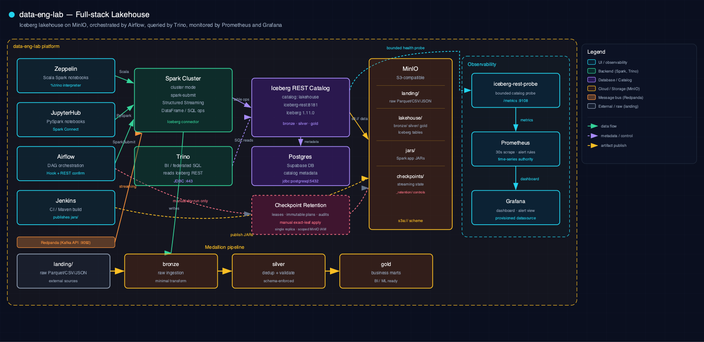

# data-eng-lab



**An Iceberg-lakehouse data-engineering lab built on the [Atlas](https://github.com/thekaveh/atlas) platform.**

`data-eng-lab` consumes Atlas as its pinned `infra/` git submodule through `atlas.consumer.yml`, so `make up` launches the default development profile as the **Data Engineering** workspace. It pairs 19 Zeppelin and Jupyter scenario notebooks—17 Scala/PySpark implementations plus two Trino client pairs—with Iceberg on MinIO, Airflow, Jenkins-built Spark apps, Trino, and Redpanda for three broker-backed streams.

| Area | Technology |
|---|---|
| Platform | Atlas · Docker Compose · consumer manifest overrides |
| Compute and notebooks | Apache Spark · Jupyter · Zeppelin |
| Lakehouse and storage | Apache Iceberg · Iceberg REST · MinIO |
| Orchestration and delivery | Apache Airflow · Jenkins · Maven |
| Query and streaming | Trino · Redpanda · Spark Structured Streaming |

## 1. Quick start

```bash
git submodule update --init --recursive infra
uv sync --all-groups
make up
make datasets
make verify
```

The launcher validates `atlas.consumer.yml`, materializes the Atlas environment, starts the data-engineering track, registers the Iceberg namespaces, and runs the repository preflight. See [Getting started](docs/getting-started.md) for prerequisites, endpoints, and the complete walkthrough.

## 2. Architecture

The landing zone and the three Iceberg medallion layers are distinct storage stages:

```text
s3a://landing/  →  bronze  →  silver  →  gold
raw source data    clean      enriched    aggregated/modelled
```

Every curated table is an Apache Iceberg table accessed through the Atlas Iceberg REST catalog (`lakehouse`). Spark supplies compute, Trino handles ad-hoc and federated SQL, and Airflow schedules production DAGs. Jenkins builds Maven Scala Spark apps and publishes their JARs to MinIO. Redpanda (Kafka-compatible) backs the event-ingest, windowing, and CDC streaming scenarios. `streaming_ingest-gh_archive-spark-iceberg` uses an incremental file source and requires no Kafka broker.

## 3. Explore the lab

| Destination | What it contains |
|---|---|
| [Scenario catalog](docs/scenarios/index.md) | All 19 end-to-end scenarios, dependencies, execution modes, and source datasets |
| [Notebook walkthroughs](docs/notebooks/index.md) | Side-by-side docs for 17 Scala/PySpark pairs and two Trino SQL/client pairs |
| [Spark apps](docs/spark-apps/index.md) | Two CI-built Maven applications published by Jenkins and submitted through Airflow |
| [Datasets](docs/datasets.md) | NYC Taxi, TPC-H, Online Retail, GH Archive, and MovieLens data plus synthetic events |
| [Lakehouse design](docs/lakehouse.md) | Landing, bronze, silver, gold, namespaces, buckets, and catalog behavior |
| [Atlas enablement](docs/atlas-enablement.md) | Accepted consumer configuration and the A1–A9 infrastructure record |
| [Go-live runbook](docs/go-live.md) | Reproducible platform, notebook, DAG, and Spark-application acceptance |

## 4. By the numbers

| Inventory | Count |
|---|---:|
| Paired Zeppelin and Jupyter scenario implementations | 19 |
| Dual-language Scala/PySpark parity pairs | 17 |
| Redpanda-backed Structured Streaming scenarios | 3 |
| Incremental file-source Structured Streaming scenarios | 1 |
| CI-built Maven Spark apps | 2 |
| Curated downloaded datasets | 5 |
| Iceberg medallion layers | 3 |

> New here? Run the [Getting started](docs/getting-started.md) walkthrough, then choose a scenario from the [catalog](docs/scenarios/index.md).
