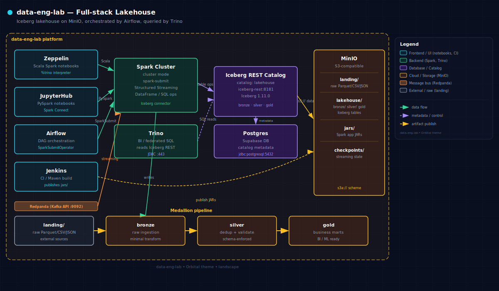

# data-eng-lab

**An Iceberg-lakehouse data-engineering lab built on the [Atlas](https://github.com/thekaveh/atlas) platform.**

Curated Spark scenarios in Scala (Zeppelin) and PySpark (Jupyter), orchestrated with Airflow, plus Maven Scala Spark apps built by Jenkins — all over Apache Iceberg on MinIO, cataloged by the Atlas Iceberg REST catalog.

---

## Architecture



The lab implements a **medallion lakehouse** with four layers:

```
s3a://landing/   →   bronze   →   silver   →   gold
  (raw Parquet)       (clean)     (enriched)   (aggregated/modelled)
```

Every table is an **Apache Iceberg** table, accessed through the Atlas **Iceberg REST catalog** (`lakehouse`). Compute is provided by a Spark cluster; Trino handles ad-hoc SQL and federated queries. Redpanda (Kafka-compatible) drives all streaming scenarios. Airflow schedules production DAGs; Jenkins builds and publishes Maven Spark apps to MinIO artifacts.

---

## Quick navigation

<div class="grid cards" markdown>

-   :material-database-search:{ .lg .middle } **Scenario catalog**

    ---

    19 end-to-end Spark and Trino scenarios across bronze, silver, and gold layers.

     [:octicons-arrow-right-24: Browse scenarios](scenarios/index.md)

-   :material-rocket-launch:{ .lg .middle } **Spark apps**

    ---

    2 CI-verified Maven Scala Spark apps built by Jenkins and run by Airflow.

     [:octicons-arrow-right-24: Browse apps](spark-apps/index.md)

-   :material-table-large:{ .lg .middle } **Datasets**

    ---

    5 curated datasets (NYC Taxi, TPC-H, Online Retail, GH Archive, Events) with `make datasets`.

    [:octicons-arrow-right-24: Dataset guide](datasets.md)

-   :material-layers-triple:{ .lg .middle } **Lakehouse design**

    ---

    Medallion layout, Iceberg namespaces, MinIO buckets, and the bronze smoke test.

    [:octicons-arrow-right-24: Lakehouse guide](lakehouse.md)

-   :material-check-decagram:{ .lg .middle } **Atlas platform**

    ---

    A1–A9 Atlas enablement checklist, expectations, and go-live runbook.

    [:octicons-arrow-right-24: Atlas enablement](atlas-enablement.md)

-   :material-play-box-multiple:{ .lg .middle } **Getting started**

    ---

    Prerequisites, `make datasets`, starting the stack, and running notebooks.

    [:octicons-arrow-right-24: Quick start](getting-started.md)

</div>

---

## By the numbers

| What | Count |
|------|-------|
| Scenario notebooks (Scala + PySpark pairs) | 19 (14 batch, 4 streaming, 1 hybrid) |
| CI-verified Maven Spark apps | 2 |
| Curated datasets | 5 |
| Atlas enablement items (A1–A9) | 9 |
| Iceberg medallion layers | 3 (bronze / silver / gold) |

---

## Scenario catalog

| Scenario | Engine | Layer | Dataset |
|---|---|---|---|
| [batch_ingest-nyc_taxi-spark-iceberg](scenarios/batch_ingest-nyc_taxi-spark-iceberg.md) | Spark | Bronze | NYC Taxi |
| [medallion-nyc_taxi-spark-iceberg](scenarios/medallion-nyc_taxi-spark-iceberg.md) | Spark | Bronze→Silver→Gold | NYC Taxi |
| [data_quality-nyc_taxi-spark-iceberg](scenarios/data_quality-nyc_taxi-spark-iceberg.md) | Spark | Silver | NYC Taxi |
| [schema_evolution-gh_archive-spark-iceberg](scenarios/schema_evolution-gh_archive-spark-iceberg.md) | Spark | Silver | GH Archive |
| [time_travel-nyc_taxi-spark-iceberg](scenarios/time_travel-nyc_taxi-spark-iceberg.md) | Spark | Silver | NYC Taxi |
| [table_maintenance-nyc_taxi-spark-iceberg](scenarios/table_maintenance-nyc_taxi-spark-iceberg.md) | Spark | Silver | NYC Taxi |
| [streaming_ingest-events-spark-iceberg](scenarios/streaming_ingest-events-spark-iceberg.md) | Spark (stream) | Bronze | Events |
| [streaming_ingest-gh_archive-spark-iceberg](scenarios/streaming_ingest-gh_archive-spark-iceberg.md) | Spark (stream) | Bronze | GH Archive |
| [streaming_windows-events-spark-iceberg](scenarios/streaming_windows-events-spark-iceberg.md) | Spark (stream) | Silver | Events |
| [cdc_streaming-online_retail-spark-iceberg](scenarios/cdc_streaming-online_retail-spark-iceberg.md) | Spark (stream) | Silver | Online Retail |
| [federated_query-nyc_taxi-trino-iceberg](scenarios/federated_query-nyc_taxi-trino-iceberg.md) | Trino | Gold | NYC Taxi |
| [bi_query-tpch-trino-iceberg](scenarios/bi_query-tpch-trino-iceberg.md) | Trino | Gold | TPC-H |
| [join_optimization-tpch-spark-iceberg](scenarios/join_optimization-tpch-spark-iceberg.md) | Spark | Gold | TPC-H |
| [star_schema-tpch-spark-iceberg](scenarios/star_schema-tpch-spark-iceberg.md) | Spark | Gold | TPC-H |
| [feature_engineering-movielens-spark-iceberg](scenarios/feature_engineering-movielens-spark-iceberg.md) | Spark | Gold | MovieLens |
| [scd2-online_retail-spark-iceberg](scenarios/scd2-online_retail-spark-iceberg.md) | Spark | Silver | Online Retail |
| [json_flatten-gh_archive-spark-iceberg](scenarios/json_flatten-gh_archive-spark-iceberg.md) | Spark | Silver | GH Archive |
| [sessionization-gh_archive-spark-iceberg](scenarios/sessionization-gh_archive-spark-iceberg.md) | Spark | Silver | GH Archive |
| [incremental_upsert-online_retail-spark-iceberg](scenarios/incremental_upsert-online_retail-spark-iceberg.md) | Spark | Silver | Online Retail |

---

## Scenarios by Category

**Batch Ingestion** — `batch_ingest`

**Medallion Pipeline** — `medallion`

**Data Quality** — `data_quality`

**Schema & Maintenance** — `schema_evolution`, `time_travel`, `table_maintenance`

**Streaming** — `streaming_ingest` (events + gh_archive), `streaming_windows`, `cdc_streaming`

**BI & Queries** — `federated_query`, `bi_query`

**Join Optimization** — `join_optimization`

**Dimensional Modeling** — `star_schema`

**Feature Engineering** — `feature_engineering`

**SCD** — `scd2`

**JSON Processing** — `json_flatten`

**Session Analysis** — `sessionization`

---

!!! tip "New here?"
    Start with [Getting started](getting-started.md) to get the stack running, then pick a scenario from the [catalog](scenarios/index.md) or dive into the [lakehouse design](lakehouse.md).

!!! info "Atlas platform"
    The Atlas platform underpins this lab. See [Atlas enablement](atlas-enablement.md) for the full A1–A9 checklist and [Go-live runbook](go-live.md) for production readiness steps.
