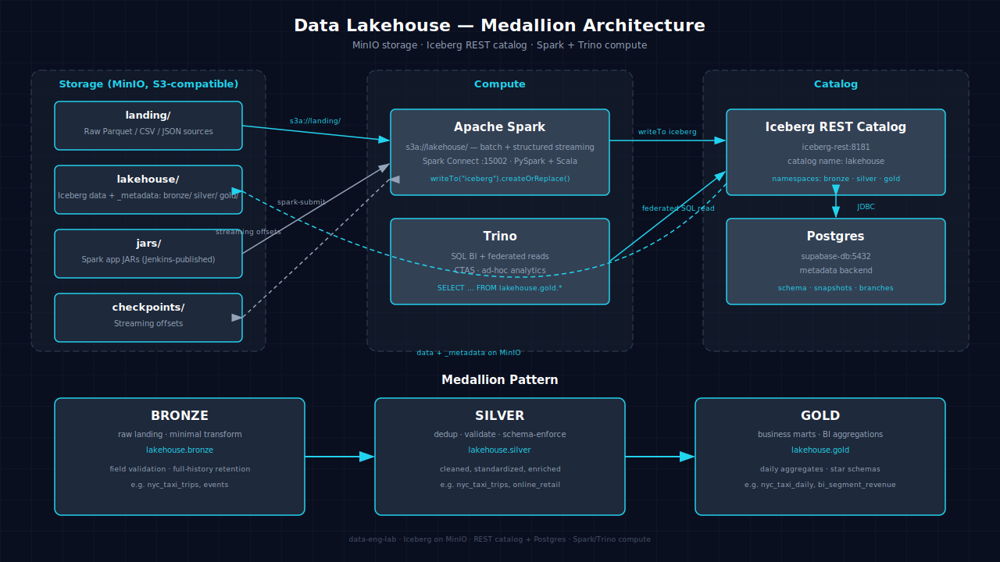

# Data Lakehouse Architecture

`data-eng-lab` runs an Apache Iceberg lakehouse on MinIO, cataloged by an Iceberg REST catalog with a Postgres backend. All data lives in S3-compatible object storage; compute (Spark, Trino) accesses data through the catalog.

The lakehouse follows the medallion pattern: bronze (raw landing) → silver (clean, deduplicated, validated) → gold (business-level aggregated marts). Iceberg's ACID transactions, time travel, Write-Audit-Publish branches, and system procedures enable zero-downtime schema evolution and data maintenance across all three layers.

The platform is orchestrated by Airflow, orchestrated from notebooks (Jupyter/PySpark and Zeppelin/Scala Spark), queried via Trino BI, and extended with streaming through Redpanda (Kafka API).



## 1. Storage Layer

All data persists in MinIO, an S3-compatible object storage service. MinIO provides four dedicated buckets:

| Bucket | Purpose |
|---|---|
| `landing/` | Raw dataset files from external sources (NYC Taxi Parquet, MovieLens CSV, GH Archive JSON, TPCH Parquet). Ingested via `make datasets` or external producers. |
| `lakehouse/` | Iceberg table data and metadata. Contains `bronze/`, `silver/`, and `gold/` directories. Each table has a Parquet data directory and Iceberg `_metadata` + snapshot files. |
| `jars/` | Compiled Spark application JARs (e.g. `nyc-taxi-etl/0.1.0/app.jar`). Published by Jenkins CI. Consumed by Airflow DAGs via `spark-submit`. |
| `checkpoints/` | Structured streaming checkpoint state. Each streaming query writes its offset state to a unique subdirectory (e.g. `checkpoints/streaming_test`, `checkpoints/events_stream`). |

Spark clients address storage as `s3a://lakehouse/` (S3A scheme); the REST catalog backend uses `s3://lakehouse/` (native S3).

## 2. Catalog

The Iceberg REST catalog (`iceberg-rest:8181`) is backed by a Supabase Postgres database. It stores table metadata (schema, partition spec, snapshots, branch info) in Postgres while the actual data lives on MinIO.

- **Catalog name:** `lakehouse`
- **JDBC connection:** `jdbc:postgresql://supabase-db:5432/iceberg`
- **Catalog type:** REST (Iceberg 1.11.0)
- **Namespaces:** `bronze`, `silver`, `gold`

The Iceberg REST catalog is built from `apache/iceberg-rest-fixture:1.10.1` with the Postgres JDBC driver layered onto the classpath.

### 2.1 Namespaces

| Namespace | Purpose | Contains |
|---|---|---|
| `lakehouse.bronze` | Raw landing, minimal transformation | `nyc_taxi_trips`, `events`, `gh_events`, `stream_events`, `windowed_events` |
| `lakehouse.silver` | Deduplicated, validated, schema-enforced | `nyc_taxi_trips` (cleaned), `gh_events_flattened`, `online_retail`, `online_retail_cdc` |
| `lakehouse.gold` | Business marts, BI-ready aggregations | `nyc_taxi_daily`, `bi_segment_revenue`, `ml_user_features`, `ml_movie_features`, `trino_payment_summary` |

Namespaces are **not pre-seeded** by Atlas. They are created at bootstrap by `scripts/register_iceberg.py` (idempotent — safe to re-run). Apps may also self-create namespaces with `CREATE NAMESPACE IF NOT EXISTS`.

## 3. The Medallion Pattern

### 3.1 Bronze

The bronze layer is the raw ingestion layer. Data is loaded as-is from the landing bucket with minimal cleaning — only field-level validation (e.g. dropping rows with null fare amounts) and column addition (e.g. `trip_date`, `ingested_at`). Bronze tables preserve the full historical record and form the foundation for all downstream processing.

**Examples:** `nyc_taxi_trips` (raw taxi trips), `events` (real-time Kafka stream), `gh_events` (file-source streaming), `gh_events_flattened` (flattened JSON from GH Archive).

### 3.2 Silver

The silver layer applies quality rules, deduplication, and schema enforcement. Duplicate rows are removed, inconsistent fields are standardized, and new columns from schema evolution are populated — old rows receive NULLs for newly added columns, maintaining backward compatibility.

**Examples:** `nyc_taxi_trips` (deduplicated and validated), `gh_events` (deduplicated events), `online_retail` (merged CDC upserts), `online_retail_cdc` (real-time CDC stream).

### 3.3 Gold

The gold layer contains business-level marts and pre-aggregated metrics. These tables are optimized for BI and analytics queries, with star-schema fact/dimension tables, daily aggregations, and ML feature engineering outputs. They are consumed by Trino for SQL BI, and by ML pipelines via Spark MLlib.

**Examples:** `nyc_taxi_daily` (daily trip aggregations), `bi_segment_revenue` (TPCH revenue by market segment), `ml_user_features` and `ml_movie_features` (collaborative filtering features), `order_fact` + `customer_dim` (TPCH star schema).

## 4. Integration Matrix (Preflight Layer 2)

| Client | Capabilities | Storage/Target |
|---|---|---|
| Spark Connect (JupyterHub) | PySpark, PyIceberg, streaming | `s3a://lakehouse/` + Iceberg catalog |
| Zeppelin (Scala) | Spark Scala, `%trino` interpreter for Trino queries | `s3a://lakehouse/` + Iceberg catalog |
| Trino | SQL queries, CTAS, federated reads over Iceberg REST | Reads `lakehouse.*` tables (bronze/silver/gold) |
| Airflow | SparkSubmitOperator (cluster mode), DAG orchestration | `s3a://jars/` for JARs, `s3a://lakehouse/` for Iceberg |
| Jenkins CI | Maven build, JAR publishing to MinIO | Publishes to `s3a://jars/` |
| Spark → Redpanda | Structured Streaming writeStream to Kafka API topics | `redpanda:9092` topics |

## 5. Bronze Smoke Test

Validate the lakehouse is end-to-end operational:

```bash
uv run python scripts/bronze_smoke.py
```

This script loads a landing dataset (NYC Taxi) into `lakehouse.bronze.*` via Spark Connect, confirming that the full path — MinIO → Spark → Iceberg catalog → MinIO data — is functional.

## 6. Iceberg Features in Use

| Feature | Scenarios That Use It |
|---|---|
| `MERGE INTO` (upserts/CDC) | `incremental_upsert-online_retail-spark-iceberg`, `scd2-online_retail-spark-iceberg`, `cdc_streaming-online_retail-spark-iceberg` |
| Snapshots / `VERSION AS OF` | `time_travel-nyc_taxi-spark-iceberg` |
| Rollback (`system.rollback_to_snapshot`) | `time_travel-nyc_taxi-spark-iceberg` |
| Branch/tag (WAP) | `time_travel-nyc_taxi-spark-iceberg` |
| `system.rewrite_data_files` (compaction) | `table_maintenance-nyc_taxi-spark-iceberg` |
| `system.expire_snapshots` | `table_maintenance-nyc_taxi-spark-iceberg` |
| `system.remove_orphan_files` | `table_maintenance-nyc_taxi-spark-iceberg` |
| Schema evolution (ADD/RENAME columns) | `schema_evolution-gh_archive-spark-iceberg` |
| `from_json` / `explode` (JSON flatten) | `json_flatten-gh_archive-spark-iceberg` |
| Structured streaming (`readStream.format`) | `streaming_ingest-events-spark-iceberg`, `streaming_ingest-gh_archive-spark-iceberg`, `streaming_windows-events-spark-iceberg`, `cdc_streaming-online_retail-spark-iceberg` |
| Window + watermark functions | `streaming_windows-events-spark-iceberg`, `sessionization-gh_archive-spark-iceberg` |
| CTAS (`CREATE TABLE AS SELECT`) | `bi_query-tpch-trino-iceberg`, `federated_query-nyc_taxi-trino-iceberg` |

## 7. See Also

- [Getting Started](getting-started.md)
- [Atlas Expectations](atlas-expectations.md)
- [Datasets](datasets.md)
- [Atlas Go-Live Findings](atlas-feedback-go-live.md)

## 8. Scenarios Using Lakehouse

### Bronze-layer scenarios
- [batch_ingest-nyc_taxi-spark-iceberg](scenarios/batch_ingest-nyc_taxi-spark-iceberg.md)
- [streaming_ingest-events-spark-iceberg](scenarios/streaming_ingest-events-spark-iceberg.md)
- [streaming_ingest-gh_archive-spark-iceberg](scenarios/streaming_ingest-gh_archive-spark-iceberg.md)

### Silver-layer scenarios
- [data_quality-nyc_taxi-spark-iceberg](scenarios/data_quality-nyc_taxi-spark-iceberg.md)
- [json_flatten-gh_archive-spark-iceberg](scenarios/json_flatten-gh_archive-spark-iceberg.md)
- [incremental_upsert-online_retail-spark-iceberg](scenarios/incremental_upsert-online_retail-spark-iceberg.md)
- [scd2-online_retail-spark-iceberg](scenarios/scd2-online_retail-spark-iceberg.md)
- [streaming_windows-events-spark-iceberg](scenarios/streaming_windows-events-spark-iceberg.md)
- [cdc_streaming-online_retail-spark-iceberg](scenarios/cdc_streaming-online_retail-spark-iceberg.md)
- [schema_evolution-gh_archive-spark-iceberg](scenarios/schema_evolution-gh_archive-spark-iceberg.md)
- [time_travel-nyc_taxi-spark-iceberg](scenarios/time_travel-nyc_taxi-spark-iceberg.md)
- [table_maintenance-nyc_taxi-spark-iceberg](scenarios/table_maintenance-nyc_taxi-spark-iceberg.md)
- [sessionization-gh_archive-spark-iceberg](scenarios/sessionization-gh_archive-spark-iceberg.md)

### Gold-layer scenarios
- [medallion-nyc_taxi-spark-iceberg](scenarios/medallion-nyc_taxi-spark-iceberg.md)
- [star_schema-tpch-spark-iceberg](scenarios/star_schema-tpch-spark-iceberg.md)
- [feature_engineering-movielens-spark-iceberg](scenarios/feature_engineering-movielens-spark-iceberg.md)
- [bi_query-tpch-trino-iceberg](scenarios/bi_query-tpch-trino-iceberg.md)
- [federated_query-nyc_taxi-trino-iceberg](scenarios/federated_query-nyc_taxi-trino-iceberg.md)
- [join_optimization-tpch-spark-iceberg](scenarios/join_optimization-tpch-spark-iceberg.md)

### Spark Apps

- [nyc-taxi-etl](spark-apps/nyc-taxi-etl.md)
- [nyc-taxi-medallion](spark-apps/nyc-taxi-medallion.md)
