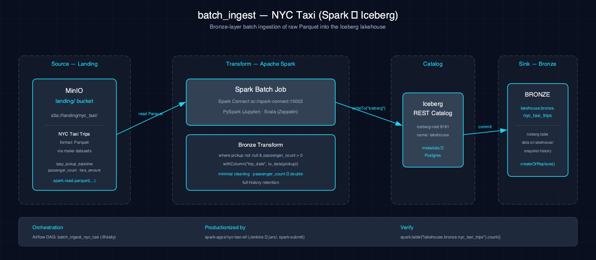

# 5.2. batch_ingest-nyc_taxi-spark-iceberg

Batch ingestion: read raw NYC taxi Trips Parquet from `s3a://landing/nyc_taxi/*` and write to an Iceberg bronze table. Scala (Zeppelin) and PySpark (Jupyter) notebooks implement the same logic.

## 1. Purpose

This is the first step in the medallion architecture — ingesting raw Parquet data into Iceberg with full history retention and schema enforcement. The bronze layer preserves source records while applying the minimum compatibility normalization needed for a stable table schema.

## 2. Data Model

### 2.1 Input Source

Source: `s3a://landing/nyc_taxi/*.parquet` (downloaded via `make datasets`).

| Column | Type | Notes |
|---|---|---|
| `VendorID` | double | Vendor identifier |
| `tpep_pickup_datetime` | timestamp | Pickup timestamp |
| `tpep_dropoff_datetime` | timestamp | Dropoff timestamp |
| `passenger_count` | double | Number of passengers; canonicalized from each source file before union |
| `trip_distance` | double | Trip distance in miles |
| `RatecodeID` | double | Rate code |
| `store_and_fwd_flag` | string | Store and forward flag |
| `PULocationID` | int | Pickup location ID |
| `DOLocationID` | int | Dropoff location ID |
| `payment_type` | double | Payment type |
| `fare_amount` | double | Fare amount |
| `extra` | double | Extra charges |
| `mta_tax` | double | MTA tax |
| `tip_amount` | double | Tip amount |
| `tolls_amount` | double | Tolls amount |
| `improvement_surcharge` | double | Improvement surcharge |
| `total_amount` | double | Total amount |
| `congestion_surcharge` | double | Congestion surcharge |

### 2.2 Output Tables

| Table | Layer | Key Columns |
|---|---|---|
| `lakehouse.bronze.nyc_taxi_trips` | Bronze | Source columns, with `passenger_count` canonicalized to `double` |

## 3. Architecture



Raw Parquet trip data flows from the S3 landing zone through Spark batch processing into an Iceberg bronze table in the `lakehouse.bronze` namespace. The notebooks select the declared `tiny`, `small`, or `medium` file list deterministically (default `small`, matching `make datasets`), normalize `passenger_count` to `double` per file, and then union by name. This preserves source records while avoiding the known March `INT64` / double incompatibility.

## 4. Notebooks

- **Zeppelin (Scala):** `zeppelin/notebook.zpln` — Sections: Overview, Read Raw Parquet, Write to Iceberg, Verify
- **Jupyter (PySpark):** `jupyter/notebook.ipynb` — Same sections; same batch ingest logic using PySpark DataFrame reader and writer

Both languages implement identical ingestion logic with source read, Iceberg write, and verification sections.

## 5. Orchestration

Airflow DAG: `batch_ingest_nyc_taxi` — a scheduled batch DAG.

## 6. Usage

1. Ensure the `bronze` Iceberg namespace exists: `scripts/register_iceberg.py`
2. Populate the landing zone: `make datasets`. The notebooks default to the same `small` tier; change their `taxiDatasetScale` / `taxi_dataset_scale` setting only when you load `tiny` or `medium`.
3. Open either notebook on the Atlas stack, or trigger the Airflow DAG:
     ```bash
     airflow dags trigger batch_ingest_nyc_taxi
     ```
4. Verify:
     ```bash
     spark-sql -e "SELECT COUNT(*) FROM lakehouse.bronze.nyc_taxi_trips"
     ```

## 7. Dependencies

- **Dataset:** NYC Taxi Trips Parquet from `s3a://landing/nyc_taxi/`
- **Atlas services:** A1-A4 (Spark, Iceberg, S3 catalog, lakehouse catalog)
- **Other:** None

## 8. Known Issues & Caveats

Notebook execution and Scala/PySpark parity are live-gated on Atlas A1-A4. The `bronze` namespace must exist; run `scripts/register_iceberg.py` first. At scale, the inline seed can be replaced by the registered CSV dataset. Drop the target table first for a clean demo if re-running.

## See Also

- [Related: table_maintenance-nyc_taxi-spark-iceberg](./table_maintenance-nyc_taxi-spark-iceberg.md) — Table maintenance patterns
- [Related: data_quality-nyc_taxi-spark-iceberg](./data_quality-nyc_taxi-spark-iceberg.md) — Quality checks on ingested data
- [Related: medallion-nyc_taxi-spark-iceberg](./medallion-nyc_taxi-spark-iceberg.md) — Medallion transforms downstream
- [Related: time_travel-nyc_taxi-spark-iceberg](./time_travel-nyc_taxi-spark-iceberg.md) — Iceberg time travel on ingested tables
- [Production Spark app: nyc-taxi-etl](../spark-apps/nyc-taxi-etl.md) — Phase-3a JAR productionizes this scenario for Airflow
- [Datasets](../datasets.md)
- [Lakehouse Architecture](../lakehouse.md)
