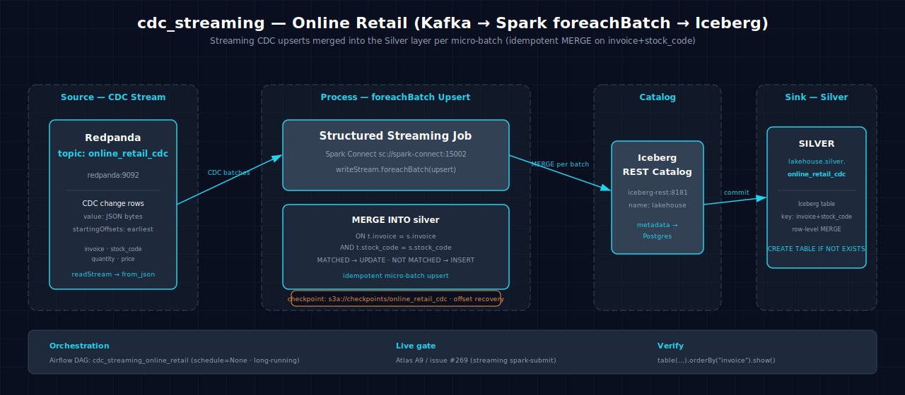

# cdc_streaming-online_retail-spark-iceberg

Streaming CDC (Change Data Capture) upserts from the Redpanda `online_retail_cdc` topic, applied to an Iceberg table via `foreachBatch` + `MERGE INTO` for idempotent real-time updates.

## 1. Purpose

This scenario demonstrates streaming CDC upserts using Kafka + Spark Structured Streaming combined with Iceberg's `MERGE INTO` syntax. The `foreachBatch` pattern allows full DML control per micro-batch — each incoming batch of changes is merged into the target Iceberg table, updating existing rows and inserting new ones. This is the streaming counterpart of the batch `incremental_upsert-online_retail` scenario.

## 2. Data Model

### 2.1 Input Source

Source: `redpanda:9092` → `online_retail_cdc` Kafka topic (JSON messages).

| Column | Type | Notes |
|---|---|---|
| `invoice` | string | Invoice number (part of composite key) |
| `stock_code` | string | Product code (part of composite key) |
| `quantity` | int | Quantity ordered |
| `price` | double | Unit price |
| `CustomerID` | double (nullable) | Customer identifier |
| `Country` | string | Customer country |

Checkpoint: `s3a://checkpoints/online_retail_cdc`

### 2.2 Output Tables

| Table | Layer | Key Columns |
|---|---|---|
| `lakehouse.silver.online_retail_cdc` | Silver | Same as input schema; updated and inserted rows reflect latest values |

## 3. Architecture



CDC events flow from the Redpanda `online_retail_cdc` topic through Spark Structured Streaming (`readStream` + `from_json`) into an Iceberg table. Each micro-batch triggers a `foreachBatch` callback that executes `MERGE INTO` — the same MERGE SQL as the batch `incremental_upsert-online_retail` scenario. The upsert key is the composite `(invoice, stock_code)`.

## 4. Notebooks

- **Zeppelin (Scala):** `zeppelin/notebook.zpln` — Sections: Overview, Setup, Read (`CREATE TABLE` + `readStream` + `from_json`), Transform (pass-through), Write (`foreachBatch` + `MERGE INTO`), Verify; 6 sections; Scala uses an anonymous function for the foreachBatch callback
- **Jupyter (PySpark):** `jupyter/notebook.ipynb` — Same 6 sections; PySpark uses `upsert_batch` function; the `MERGE INTO` SQL string is identical across both languages

## 5. Orchestration

Streaming queries are long-running and not scheduled as batch DAGs. The Airflow DAG (`cdc_streaming_online_retail`) is an `EmptyOperator` placeholder.

## 6. Usage

1. Start Atlas with Redpanda: `make up` (requires Atlas A9 / issue #269)
2. Produce CDC events to the `online_retail_cdc` topic (JSON: `invoice`, `stock_code`, `quantity`, `price`)
3. Open either notebook on the Atlas stack and run all sections
4. The `writeStream.foreachBatch` call upserts each micro-batch; verify:
    ```bash
    spark-sql -e "SELECT * FROM lakehouse.silver.online_retail_cdc ORDER BY invoice LIMIT 10"
    ```

## 7. Dependencies

- **Dataset:** Synthetic CDC events (producer must emit JSON with schema `{invoice, stock_code, quantity, price}`)
- **Atlas services:** A1-A4 (Spark, Iceberg, S3 catalog, lakehouse catalog), A9 (Redpanda)
- **Other:** None

## 8. Known Issues & Caveats

The `online_retail_cdc` topic is auto-created on first produce. Notebook execution and Scala/PySpark parity are live-gated on Atlas A9 (Redpanda). Produce CDC events to the topic before running. Checkpoints at `s3a://checkpoints/online_retail_cdc`. The `MERGE INTO` SQL is identical to the batch `incremental_upsert-online_retail` scenario — this is its streaming form. The DAG (`cdc_streaming_online_retail`) is an `EmptyOperator`.

## See Also

- [Related: incremental_upsert-online_retail-spark-iceberg](./incremental_upsert-online_retail-spark-iceberg.md) — Batch form of the same CDC upsert pattern
- [Related: scd2-online_retail-spark-iceberg](./scd2-online_retail-spark-iceberg.md) — Another online_retail dimension scenario
- [Datasets](../datasets.md)
- [Lakehouse Architecture](../lakehouse.md)
