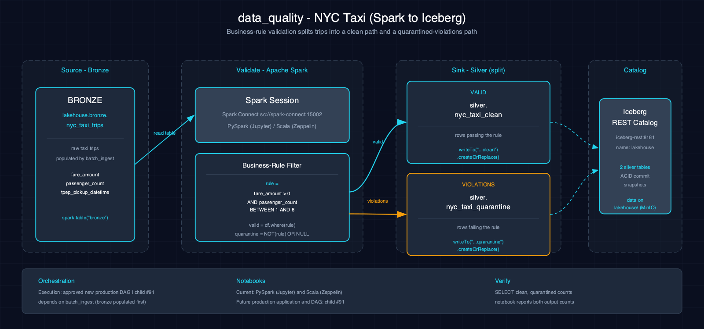

# 5.8. data_quality-nyc_taxi-spark-iceberg

Splits Bronze NYC taxi trips into clean and quarantine Iceberg tables with one explicit fare-and-passenger rule.

## 1. Purpose

This scenario demonstrates a small, executable quality boundary. Both paired notebooks read `lakehouse.bronze.nyc_taxi_trips`, apply the exact rule `fare_amount > 0 AND passenger_count BETWEEN 1 AND 6`, and materialize separate Silver outputs for rows that pass or fail that rule.

## 2. Data Model

### 2.1 Input Source

The current notebooks call `spark.table("lakehouse.bronze.nyc_taxi_trips")`. The Bronze table is populated by `batch_ingest-nyc_taxi-spark-iceberg` from a resolver-verified immutable NYC Taxi generation.

### 2.2 Output Tables

| Table | Layer | Current notebook behavior |
|---|---|---|
| `lakehouse.silver.nyc_taxi_clean` | Silver | Rows where fare is positive and passenger count is between 1 and 6 |
| `lakehouse.silver.nyc_taxi_quarantine` | Silver | Rows matching `NOT (rule) OR fare_amount IS NULL` |

Each notebook writes both tables with Iceberg `writeTo(...).using("iceberg").createOrReplace()`.

## 3. Architecture



The current notebook path is an interactive Bronze-to-Silver split. The approved production boundary in #91 is future work and does not describe code that exists in this scenario today.

## 4. Notebooks

- **Zeppelin (Scala):** the paired notebook reads the Bronze table, applies the exact rule, replaces both Silver tables, and queries their row counts.
- **Jupyter (PySpark):** the paired notebook performs the same read, filter, two `createOrReplace` writes, and count verification.

### 4.1 Current notebook behavior

Both notebooks execute the same table names and operations. They do not yet persist run-level quality facts, implement configurable rule ownership or severity, or publish a dashboard.

### 4.2 Future production scope (#91)

Child #91 owns a reviewed Spark standalone application and operator-owned Atlas Airflow DAG, durable Bronze/Silver/Gold quality facts, governed thresholds and failure semantics, a dashboard or query surface, operator response, and terminal live Airflow/Spark acceptance. Those deliverables are not implemented by the current notebooks.

## 5. Orchestration

Classification: **approved new production DAG**. No production DAG exists yet. Until #91 passes its implementation and live-acceptance contract, run the paired notebooks interactively.

## 6. Usage

1. Run the production `nyc_taxi_etl` DAG so `lakehouse.bronze.nyc_taxi_trips` exists.
2. Open either paired notebook on the Atlas stack and run all cells.
3. Verify the two current outputs:

     ```sql
     SELECT
       (SELECT count(*) FROM lakehouse.silver.nyc_taxi_clean) AS clean,
       (SELECT count(*) FROM lakehouse.silver.nyc_taxi_quarantine) AS quarantined;
     ```

## 7. Dependencies

- **Dataset:** `lakehouse.bronze.nyc_taxi_trips` from a successful matching `nyc_taxi_etl` load
- **Runtime:** Atlas Spark Connect and the Iceberg catalog
- **Productionization:** #91 depends on #82, #81, and #78

## 8. Known Issues & Caveats

The current rule is a literal notebook string rather than a versioned policy. SQL null semantics can leave a row with a non-null fare and null passenger count outside both filters; the notebooks only report the two output counts and do not assert that they partition every Bronze row. Run-level facts, trend history, alerting, and operator workflow belong to #91.

## 9. See Also

- [Related: batch_ingest-nyc_taxi-spark-iceberg](./batch_ingest-nyc_taxi-spark-iceberg.md) — Produces the Bronze input
- [Execution-mode matrix](./execution-modes.md)
- [Datasets](../datasets.md)
- [Lakehouse Architecture](../lakehouse.md)
