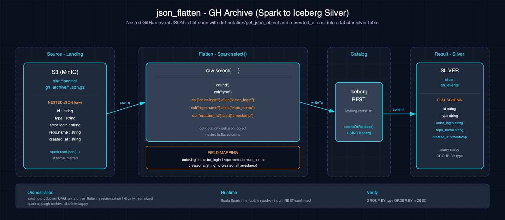

# 5.19. json_flatten-gh_archive-spark-iceberg

Reads GitHub Archive nested JSON events, extracts and flattens nested fields, casts timestamps, and writes to a flat Iceberg silver table.

## 1. Purpose

Handling semi-structured nested data is a common ETL pattern in data engineering. This scenario demonstrates converting messy JSON into well-typed columns using Spark's built-in `get_json_object` and `col` dot-notation for extracting deeply nested fields (like `actor.login` and `repo.name`), casting `created_at` to a proper timestamp, and writing the result as a flat Iceberg table for downstream consumption.

## 2. Data Model

### 2.1 Input Source

Source: compressed GitHub Archive JSON objects from one resolver-verified immutable generation published by `make datasets`.

| Column | Type | Source |
|---|---|---|
| `id` | string | JSON: `id`; required but not a primary key |
| `type` | string | JSON: `type` |
| `actor_login` | string | JSON: `actor.login` |
| `repo_name` | string | JSON: `repo.name` |
| `created_at` | timestamp | JSON: `created_at` (cast from string) |

### 2.2 Output Tables

| Table | Layer | Key Columns |
|---|---|---|
| `lakehouse.silver.gh_events` | Silver | `id`, `type`, `actor_login`, `repo_name`, `created_at` |

## 3. Architecture



Exact duplicate flattened records remain distinct. Conflicting records sharing an `id` fail the production stage before replacement.

## 4. Notebooks

- **Zeppelin (Scala):** `zeppelin/notebook.zpln` — Sections: Overview, Read JSON from S3, Extract Nested Fields, Cast Timestamps, Write to Iceberg, Verify
- **Jupyter (PySpark):** `jupyter/notebook.ipynb` — Same sections; same JSON flatten logic using `col("actor.login")` syntax and `toTimestamp`

Both languages implement identical JSON flatten logic with source read, field extraction, type casting, and sink write.

## 5. Orchestration

Classification: **existing production DAG**. `spark-apps/gh-archive-pipeline/dag.py` schedules
`gh_archive_flatten_sessionization` `@daily`, accepts an explicit manual `dataset_scale`, and uses
`max_active_runs=1`. The flatten task is the first of two independently REST-confirmed Spark stages.

## 6. Usage

1. Ensure the `silver` Iceberg namespace exists: `scripts/register_iceberg.py`
2. Populate the landing zone: `make datasets`
3. Trigger `gh_archive_flatten_sessionization` for production output, or open a notebook for an
   isolated educational run.
4. Verify output:
      ```bash
   spark-sql -e "SELECT COUNT(*) FROM lakehouse.silver.gh_events"
      ```

## 7. Dependencies

- **Dataset:** resolver-verified immutable GitHub Archive compressed JSON
- **Atlas services:** A1-A4 (Spark, Iceberg, S3 catalog, lakehouse catalog)
- **Other:** None

## 8. Known Issues & Caveats

Notebook execution and Scala/PySpark parity are live-gated on Atlas A1-A4. The notebooks directly
replace the same table but do not validate or write the production five-key provenance and are not
serialized with sessionization. Running them can invalidate production consumers; use the DAG/app
for production writes and isolate educational runs. The `silver` namespace and a verified dataset
publication must exist.

## 9. See Also

- [Related: schema_evolution-gh_archive-spark-iceberg](./schema_evolution-gh_archive-spark-iceberg.md) — Another GitHub Archive processing scenario
- [Related: sessionization-gh_archive-spark-iceberg](./sessionization-gh_archive-spark-iceberg.md) — Consumes flattened events from this scenario
- [Related: streaming_ingest-gh_archive-spark-iceberg](./streaming_ingest-gh_archive-spark-iceberg.md) — Streaming version of JSON ingest
- [Datasets](../datasets.md)
- [Lakehouse Architecture](../lakehouse.md)
