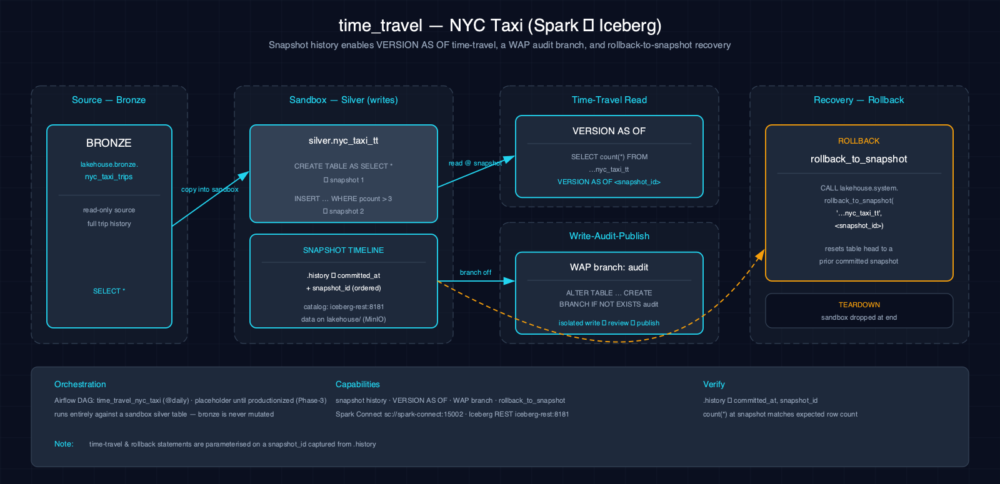

# 5.13. time_travel-nyc_taxi-spark-iceberg

Demonstrates Iceberg snapshot history and branch creation on a scenario-owned NYC taxi table; time-travel and rollback commands are documented examples, not executed cells.

## 1. Purpose

The paired notebooks create `nyc_taxi_tt`, append filtered Bronze rows to create another snapshot, create an `audit` branch, and inspect the table's history metadata. They include commented examples for `VERSION AS OF` and `rollback_to_snapshot`; neither example executes.

## 2. Data Model

### 2.1 Input Source

Source: `lakehouse.bronze.nyc_taxi_trips`, copied into the scenario-owned `lakehouse.silver.nyc_taxi_tt` table. The Bronze prerequisite originates from a resolver-verified immutable generation.

| Column | Type | Notes |
|---|---|---|
| `VendorID` | double | Vendor identifier |
| `tpep_pickup_datetime` | timestamp | Pickup timestamp |
| `tpep_dropoff_datetime` | timestamp | Dropoff timestamp |
| `passenger_count` | double | Number of passengers (canonicalized in Bronze) |
| `trip_distance` | double | Trip distance in miles |
| `fare_amount` | double | Fare amount |
| `total_amount` | double | Total amount |
| `PULocationID` | int | Pickup location ID |
| `DOLocationID` | int | Dropoff location ID |

### 2.2 Output Tables

| Table | Layer | Key Columns |
|---|---|---|
| `lakehouse.silver.nyc_taxi_tt` | Silver | Scenario-owned snapshot-history and branch target |

## 3. Architecture



NYC taxi trip data is copied into `nyc_taxi_tt`, then a filtered append creates another snapshot. The notebooks create an `audit` branch and query the history metadata table. Commented examples show how a future operator could query or roll back a chosen snapshot.

## 4. Notebooks

- **Zeppelin (Scala):** `zeppelin/notebook.zpln` — creates snapshots and the `audit` branch, then inspects history; query and rollback examples are comments
- **Jupyter (PySpark):** `jupyter/notebook.ipynb` — executes the same snapshot, branch, and history operations with the same commented examples

Both languages implement equivalent snapshot creation, branch creation, and history inspection.

## 5. Orchestration

Classification: **intentionally notebook-only**. No Airflow DAG or schedule exists. Snapshot inspection and branch operations are operator-selected demonstrations restricted to the isolated `nyc_taxi_tt` table.

## 6. Usage

1. Ensure the `silver` Iceberg namespace exists: `scripts/register_iceberg.py`
2. Open either notebook on the Atlas stack.
3. Verify:
     ```bash
     spark-sql -e "SELECT committed_at, snapshot_id FROM lakehouse.silver.nyc_taxi_tt.history ORDER BY committed_at"
     ```

## 7. Dependencies

- **Dataset:** scenario-owned NYC Taxi rows in `lakehouse.silver.nyc_taxi_tt`
- **Atlas services:** A1-A4 (Spark, Iceberg, S3 catalog, lakehouse catalog)
- **Other:** Iceberg time travel must be enabled (default configuration)

## 8. Known Issues & Caveats

Notebook execution and Scala/PySpark parity are live-gated on Atlas A1-A4. The `silver` namespace must exist; run `scripts/register_iceberg.py` first. The notebook does not execute the commented time-travel or rollback statements and does not publish the `audit` branch.

## 9. See Also

- [Related: batch_ingest-nyc_taxi-spark-iceberg](./batch_ingest-nyc_taxi-spark-iceberg.md) — Produces the bronze source data
- [Related: table_maintenance-nyc_taxi-spark-iceberg](./table_maintenance-nyc_taxi-spark-iceberg.md) — Also demonstrates time travel
- [Related: medallion-nyc_taxi-spark-iceberg](./medallion-nyc_taxi-spark-iceberg.md) — Full medallion pipeline
- [Production Spark app: nyc-taxi-medallion](../spark-apps/nyc-taxi-medallion.md) — Phase-3a JAR productionizes this scenario for Airflow
- [Datasets](../datasets.md)
- [Lakehouse Architecture](../lakehouse.md)
