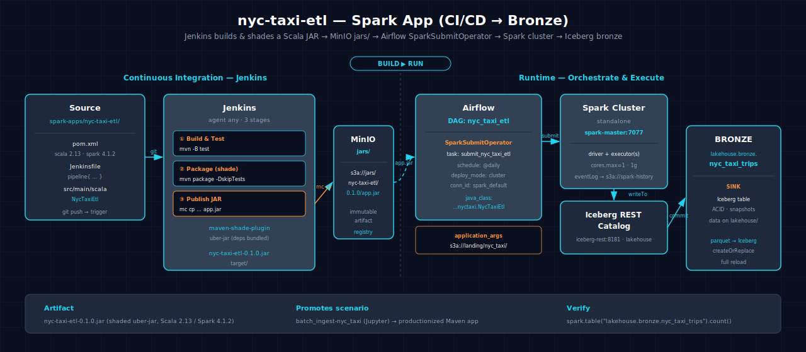

# NYC Taxi ETL — Raw to Bronze

Pure Spark application that reads raw Parquet files from the landing zone, applies quality filtering, and writes a cleaned Iceberg table at the bronze layer. This app is the first step in the lakehouse ingestion pipeline and is built by Jenkins, tested via ScalaTest, and orchestrated by Airflow.

## 1. Architecture

```
s3a://landing/nyc_taxi/*.parquet
           │
           ▼
    ┌─────────────┐
    │   GitHub     │  (Git SCM trigger)
    └──────┬──────┘
           │
           ▼
    ┌─────────────┐      ┌──────────┐
    │  Jenkins CI  │─────▶│  MinIO   │
    │ mvn test     │      │  jars/   │
    │ mvn package  │      │ app.jar  │
    └──────┬──────┘      └────┬─────┘
           │                   │
           ▼                   ▼
    ┌─────────────────────────────┐
    │        Airflow DAG           │
    │   SparkSubmitOperator        │
    └──────────────┬──────────────┘
                   │
                   ▼
    ┌─────────────────────────────┐
    │     Spark Cluster            │
    │                              │
    │  read Parquet → filter      │
    │    → write Iceberg          │
    └──────────────┬──────────────┘
                   │
                   ▼
    ┌─────────────────────────────┐
    │  lakehouse.bronze           │
    │  .nyc_taxi_trips            │
    └─────────────────────────────┘
```



- **GitHub → Jenkins:** SCM poll or webhook triggers the pipeline.
- **Jenkins CI:** runs `mvn test` then `mvn package`, producing a shaded JAR.
- **MinIO:** JAR is published to `s3a://jars/nyc-taxi-etl/0.1.0/nyc-taxi-etl.jar`.
- **Airflow:** `SparkSubmitOperator` pulls the JAR from MinIO and submits it to the Spark cluster in cluster mode.
- **Spark Cluster:** reads Parquet from `s3a://landing/nyc_taxi/`, applies `TaxiTransforms` quality filters, writes Iceberg.

## 2. Project Structure

- **Language:** Scala (2.12)
- **Build tool:** Maven (3.8+)
- **Testing:** ScalaTest 3.2.19
- **Transform source:** `src/main/scala/transforms/TaxiTransforms.scala`
- **Entrypoint:** `src/main/scala/NycTaxiEtl.scala` (argument-driven: accepts `--source` / `--sink`)
- **CI/CD:** `Jenkinsfile`, `src/main/scala/dag.py`

## 3. Transform Logic

The `TaxiTransforms` object defines a single public method `sanitize`:

1. **Input schema** — the raw Parquet schema: `id`, `type`, `actor_login` (repo), `created_at`, etc. from the `nyc_taxi` bucket.
2. **Operations:**
   - `drop null pickups` — filters out rows where the pickup datetime / primary key is null.
   - `non-positive passengers` — filters out rows with passengers <= 0.
   - `add trip_date` — derives a `trip_date` column as `to_date(created_at)`.
3. **Output schema** — same columns as input plus `trip_date`, all non-null, ready for the bronze layer.

Spark concepts used: DataFrame `filter`, `withColumn`, `drop`, typed columns via `col()`, and I/O via `spark.read.parquet` / `df.writeTo("lakehouse.bronze.nyc_taxi_trips").append()`.

## 4. Build & Test

```bash
# Run unit tests
mvn -q -B -f spark-apps/nyc-taxi-etl/pom.xml test

# Build the shaded JAR
mvn -q -B -f spark-apps/nyc-taxi-etl/pom.xml package
```

## 5. Run with Airflow

The DAG (`nyc_taxi_etl`) uses `SparkSubmitOperator` configured with:

- **application:** `s3a://jars/nyc-taxi-etl/0.1.0/nyc-taxi-etl.jar`
- **deploy-mode:** `cluster` (Spark runs on cluster YARN/K8s, not driver)
- **conf:** Iceberg SPARK config (`spark.sql.extensions=org.apache.iceberg.spark.IcebergSparkSessionExtensions`, catalog config)
- **jars:** the MinIO-published JAR
- **dependencies:** no external PyPI packages; the JAR ships its shaded dependencies

Spark reads `s3a://landing/nyc_taxi/` and writes to `lakehouse.bronze.nyc_taxi_trips`.

## 6. Prerequisites

- Atlas A5 (Jenkins CI pipeline)
- Atlas A6 (Airflow SparkSubmitOperator)
- JAR published to `s3a://jars/nyc-taxi-etl/0.1.0/nyc-taxi-etl.jar`
- Preconfigured `minio` `mc` alias and `jars` bucket (A5)
- S3A credentials available on the Spark cluster (A6)
- `s3a://landing/nyc_taxi/` populated with Parquet files

## 7. Data Flow

```
s3a://landing/nyc_taxi/*.parquet
       │
       │  read (Spark DataFrame)
       ▼
  TaxiTransforms.sanitize()
       │  drop null pickups
       │  drop non-positive passengers
       │  add trip_date
       ▼
  lakehouse.bronze.nyc_taxi_trips  (Iceberg, partitioned by trip_date)
```

## 8. See Also

- [Spark apps overview](./index.md)
- [Related scenario: batch_ingest-nyc_taxi-spark-iceberg](../scenarios/batch_ingest-nyc_taxi-spark-iceberg.md) — Produces the bronze table this app consumes
- [Related scenario: medallion-nyc_taxi-spark-iceberg](../scenarios/medallion-nyc_taxi-spark-iceberg.md) — Also consumes the bronze table
- [Lakehouse Architecture](../lakehouse.md)
- [Datasets](../datasets.md)
