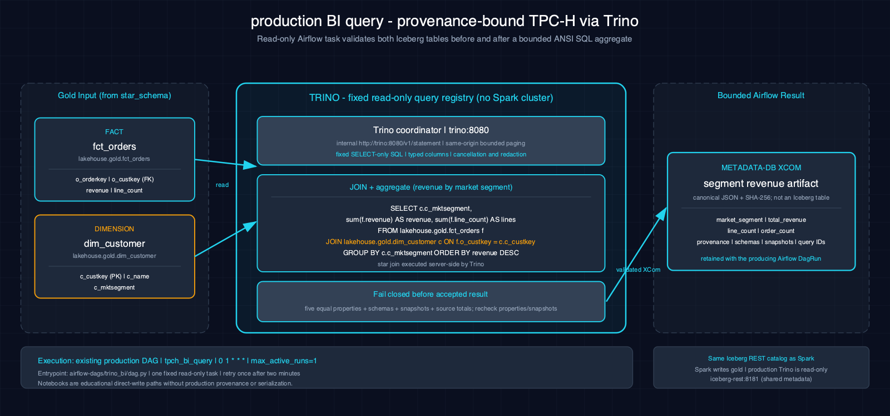

# bi_query-tpch-trino-iceberg

Queries gold-layer marts via Trino SQL, demonstrating Trino as a lightweight SQL-only analytics engine over Iceberg tables produced by Spark.

## 1. Purpose

Trino provides a lightweight, SQL-only query path over lakehouse data that complements Spark's programmatic ETL. Production reads `fct_orders` and `dim_customer`, validates that they represent one immutable TPC-H generation, and returns a bounded revenue-by-segment result without writing Iceberg. The paired notebooks retain their direct CTAS cells only as an educational comparison.

## 2. Data Model

### 2.1 Input Source

Source: `lakehouse.gold` tables written by the upstream `star_schema-tpch-spark-iceberg` scenario.

From `lakehouse.gold.fct_orders`:

| Column | Type | Notes |
|---|---|---|
| `o_orderkey` | long | Order key |
| `o_custkey` | long | Customer FK |
| `o_orderdate` | date | Order date |
| `revenue` | decimal(25,2) | Sum of line extended prices |
| `line_count` | bigint | Number of lines in the order |

From `lakehouse.gold.dim_customer`:

| Column | Type | Notes |
|---|---|---|
| `c_custkey` | long | Customer PK |
| `c_name` | string | Customer name |
| `c_mktsegment` | string | Market segment |

### 2.2 Output Tables

| Table | Layer | Key Columns |
|---|---|---|
| Airflow metadata-DB XCom | Run artifact | `market_segment`, `total_revenue`, `line_count`, `order_count` |

## 3. Architecture

Data flows from gold-layer Iceberg tables (`fct_orders`, `dim_customer`) through fixed read-only Trino SQL. The production task reads both `$properties` tables before BI SQL, validates schemas and source measures, executes the aggregate, then rereads properties and snapshots before returning a canonical XCom artifact. No Spark or Iceberg write occurs.

## 4. Notebooks

- **Zeppelin (Scala, `%trino`):** Sections: Overview, Read Gold Tables, Join + Aggregate, Write Summary, Verify; identical SQL to PySpark
- **Jupyter (Py, `trino` client):** Sections: Overview, Read Gold Tables, Join + Aggregate, Write Summary, Verify; identical SQL executed via the Trino Python client connecting to `trino:8080`

Both notebooks run the same SQL queries to demonstrate cross-engine parity. Their CTAS cells are an **educational direct-write path** that **does not enforce production provenance, snapshot checks, or serialization**. **Use the Airflow DAG for production BI queries and durable BI artifacts**; the production path itself is read-only and stores the artifact in Airflow metadata.

## 5. Orchestration

Classification: **existing production DAG** at `airflow-dags/trino_bi/dag.py`. `tpch_bi_query` runs daily at 01:00 UTC with `max_active_runs=1`, one retry, and a two-minute delay. Its bounded canonical metadata-DB XCom is retained with the Airflow metadata database and is **not an Iceberg table**; retrieve it from the task instance XCom view or API before configured metadata retention removes the DagRun.

Before any BI SQL, the task queries `lakehouse.gold."dim_customer$properties"` and `lakehouse.gold."fct_orders$properties"`. It requires exactly equal nonblank `data_eng_lab.dataset`, `data_eng_lab.dataset.scale`, `data_eng_lab.dataset.plan_id`, `data_eng_lab.dataset.publication_id`, and `data_eng_lab.dataset.manifest_sha256` values and will **fail closed before BI SQL** on absence, duplication, malformed identity, or mismatch.

## 6. Usage

1. Run the prerequisite scenario: `star_schema-tpch-spark-iceberg` (creates `fct_orders` and `dim_customer`)
2. Ensure the `gold` Iceberg namespace exists: `scripts/register_iceberg.py`
3. For production, run `airflow dags test tpch_bi_query <logical-date> --use-executor` from the scheduler or let the daily schedule run.
4. Retrieve `run_bounded_bi_query`'s `return_value` XCom through Airflow's task-instance view/API.
5. Use either paired notebook only for the educational direct-query/CTAS walkthrough.

## 7. Dependencies

- **Dataset:** TPC-H gold tables (`fct_orders`, `dim_customer`) from `lakehouse.gold`
- **Atlas services:** A5-A7 (Trino, Trino coordinator, Iceberg REST catalog)
- **Other:** `trino` Python client (Jupyter notebook)

## 8. Known Issues & Caveats

Atlas provides the Trino coordinator and the `%trino` Zeppelin interpreter. Production accepts only fixed registry SQL through internal `http://trino:8080`; no host fallback or arbitrary DagRun SQL exists. The catalog is currently unauthenticated/ALLOW_ALL, so the application-level read-only registry is a workload boundary, not a claim of catalog security. Requires the upstream `star_schema-tpch-spark-iceberg` to run first.

## See Also

- [Upstream: star_schema-tpch-spark-iceberg](../star_schema-tpch-spark-iceberg/README.md) — Populates the gold tables this scenario queries
- [Related: join_optimization-tpch-spark-iceberg](../join_optimization-tpch-spark-iceberg/README.md) — Another TPC-H query optimization scenario
- [Datasets](../../docs/datasets.md)
- [Lakehouse Architecture](../../docs/lakehouse.md)
