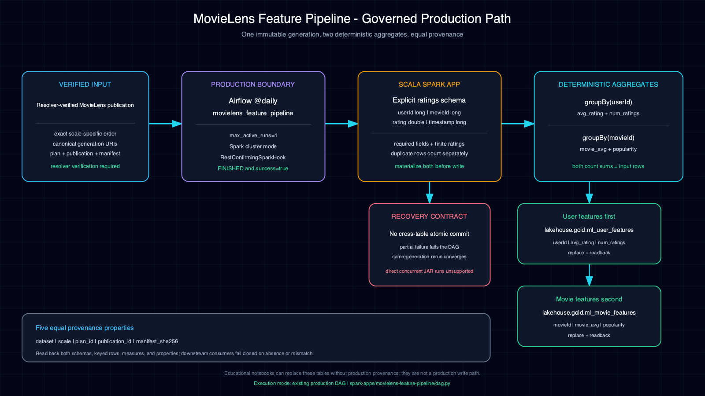

# feature_engineering-movielens-spark-iceberg

Builds deterministic per-user and per-movie rating aggregates in Iceberg. The production path is the Maven Scala application at `spark-apps/movielens-feature-pipeline` and the serialized Airflow DAG `movielens_feature_pipeline`.

## 1. Purpose

The scenario preserves the paired notebooks as educational Scala/PySpark examples while productionizing their two `groupBy` aggregations. Production accepts exactly one resolver-verified immutable MovieLens publication, validates the ratings schema, replaces both Gold tables, and reads back schemas, rows, measures, and generation provenance.

## 2. Data Model

### 2.1 Input

The complete publication crosses the application boundary in the scale-specific registry order. The application reads only `ratings.csv` with the exact schema `userId long`, `movieId long`, `rating double`, `timestamp long`; all fields are required and ratings must be finite. Duplicate rating rows intentionally count separately in both averages and counts.

### 2.2 Outputs

| Table | Ordered schema | Key |
|---|---|---|
| `lakehouse.gold.ml_user_features` | `userId long`, `avg_rating double`, `num_ratings long` | unique, non-null `userId` |
| `lakehouse.gold.ml_movie_features` | `movieId long`, `movie_avg double`, `popularity long` | unique, non-null `movieId` |

Both tables carry the same five `data_eng_lab.dataset*` Iceberg properties for dataset, scale, plan ID, publication ID, and manifest SHA-256. Both count sums equal the number of input rating rows.

## 3. Architecture

Airflow resolves and verifies a complete generation, then submits the reviewed JAR in Spark standalone cluster mode through Atlas's REST-confirming adapter. Spark validates and materializes both aggregates, replaces the user table first and movie table second, and verifies both outputs before success.

## 4. Notebooks

The paired Zeppelin (`zeppelin/notebook.zpln`) and Jupyter (`jupyter/notebook.ipynb`) notebooks implement the same two aggregations for education and language parity.

## 5. Orchestration

Classification: **existing production DAG**. `spark-apps/movielens-feature-pipeline/dag.py` schedules `movielens_feature_pipeline` `@daily`, accepts an explicit manual `dataset_scale`, and sets `max_active_runs=1`. Success requires both Airflow success and Spark `FINISHED` with `success=true`.

Iceberg has no cross-table atomic commit. A failure between writes leaves a partial generation; the supported recovery is a deterministic same-generation rerun. Airflow serialization prevents supported runs from interleaving. Concurrent direct JAR invocations are unsupported.

## 6. Usage

1. Publish and verify the requested MovieLens scale with the supported dataset tooling.
2. Build and publish the reviewed `spark-apps/movielens-feature-pipeline` JAR through Jenkins.
3. Trigger `movielens_feature_pipeline`, optionally with `{"dataset_scale":"tiny|small|medium"}`.
4. Verify both table schemas, row counts, count sums, and all five properties.

## 7. Dependencies

- #81 resolver-verified immutable MovieLens publication
- Atlas Airflow, Spark standalone, Iceberg REST catalog, and S3A runtime
- Jenkins-published `s3a://jars/movielens-feature-pipeline/0.1.0/app.jar`

## 8. Known Issues & Caveats

There is no cross-table atomic commit. The Airflow task fails on either write or readback error; recover a partial generation by rerunning the same verified immutable publication. Do not run the notebooks against shared production Gold tables.

## 9. Notebook Trust Boundary

The paired Zeppelin and Jupyter notebooks demonstrate equivalent aggregations, but they are not a supported production write path. They infer schema and directly replace the same two tables without complete-publication validation, production provenance, serialization, or readback checks. Running a notebook against production tables can invalidate provenance for downstream consumers; use `movielens_feature_pipeline` for production writes.

## See also

- [Production application](../../spark-apps/movielens-feature-pipeline/README.md)
- [Datasets](../../docs/datasets.md)
- [Execution-mode matrix](../../docs/scenarios/execution-modes.md)
