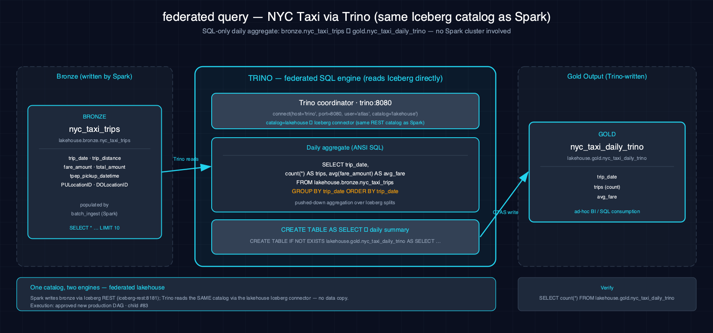

# federated_query-nyc_taxi-trino-iceberg

Query the NYC-taxi Iceberg lakehouse via Trino SQL — `lakehouse.bronze.nyc_taxi_trips` → `lakehouse.gold.nyc_taxi_daily_trino` — from both a Zeppelin `%trino` notebook and a Jupyter notebook using the `trino` Python client. Both surfaces run identical SQL.

## 1. Purpose

This scenario demonstrates Trino as a query engine over the same Iceberg lakehouse used by Spark scenarios. Trino reads Iceberg tables directly via the `lakehouse` catalog, aggregates NYC-taxi trips into a daily summary, and writes the result back to the gold layer — all via standard ANSI SQL (no Spark required). It provides a lightweight SQL-only alternative to PySpark/Scala workloads, complementing Spark's programmatic ETL with ad-hoc querying.

## 2. Data Model

### 2.1 Input Source

Source: `lakehouse.bronze.nyc_taxi_trips` (populated by `batch_ingest-nyc_taxi-spark-iceberg`).

### 2.2 Output Tables

| Table | Layer | Key Columns |
|---|---|---|
| `lakehouse.gold.nyc_taxi_daily_trino` | Gold | `trip_date`, `trip_count`, `avg_fare` (aggregated daily summary) |

## 3. Architecture

Data flows from the bronze Iceberg table through Trino SQL aggregation into the gold layer. Trino reads directly from the Iceberg REST catalog (same catalog as Spark), executes ANSI SQL queries for daily aggregation, and writes results back — no Spark cluster involved.

## 4. Notebooks

- **Zeppelin (Scala, `%trino`):** Sections: Overview → Read Bronze Table, Aggregate by Day, Write Gold Summary → Verify; identical SQL to PySpark
- **Jupyter (Py, `trino`):** Same sections; identical SQL via the Trino Python client

## 5. Orchestration

Classification: **approved new production DAG**. No production DAG exists yet. Child #83 owns the proven Airflow/Trino execution contract and meaningful-result validation; until it passes live acceptance, run the paired Trino notebooks only.

## 6. Usage

1. Populate bronze table: `batch_ingest-nyc_taxi-spark-iceberg` (or ensure it exists)
2. Ensure the `gold` Iceberg namespace exists: `scripts/register_iceberg.py`
3. Open either notebook on the Atlas stack (Trino coordinator at `trino:8080`) and run all sections
4. Verify: `spark-sql -e "SELECT * FROM lakehouse.gold.nyc_taxi_daily_trino LIMIT 10"`

## 7. Dependencies

- **Dataset:** NYC Taxi trips via `lakehouse.bronze.nyc_taxi_trips`
- **Atlas services:** A5-A7 (Trino, Trino coordinator, Iceberg REST catalog)
- **Other:** None

## 8. Known Issues & Caveats

Atlas provides the Trino coordinator and both notebooks are live-gated; production orchestration remains owned by child #83. The `%trino` interpreter is seeded by Atlas pointing to the Trino coordinator. The `lakehouse.gold` namespace must exist in the Iceberg REST catalog before the Write cell runs.

## See Also

- [Upstream: batch_ingest-nyc_taxi-spark-iceberg](../batch_ingest-nyc_taxi-spark-iceberg/README.md) — Populates the bronze table
- [Datasets](../../docs/datasets.md)
- [Lakehouse Architecture](../../docs/lakehouse.md)
