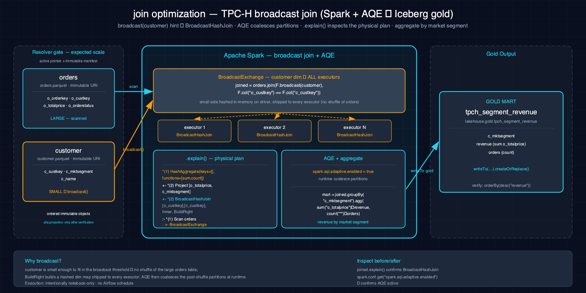

# join_optimization-tpch-spark-iceberg

Optimizes Spark join strategies for large-scale TPCH data with Iceberg table partitions, exploring broadcast joins, sort-merge joins, and bucket joins for different data sizes.

## 1. Purpose

Performance optimization of join operations is a critical concern in data engineering. This scenario demonstrates three join optimization techniques with Spark and Iceberg on TPCH data: (1) broadcast joins for small tables, (2) sort-merge joins for large tables, and (3) bucket-aware joins where both tables are bucketed on the join key. It compares performance characteristics and shows when each strategy is most effective.

## 2. Data Model

### 2.1 Input Source

Source: TPC-H Parquet objects from one resolver-verified immutable generation published by `make datasets`.

| Column | Type | Source |
|---|---|---|
| Various TPCH columns | varied | tpch tables (lineitem, orders, customer, supplier, etc.) |

### 2.2 Output Tables

| Table | Layer | Key Columns |
|---|---|---|
| `lakehouse.silver.tpch_joined_optimized` | Silver | TPCH joins optimized with broadcast, sort-merge, and bucket strategies |

## 3. Architecture



TPCH parquets flow from S3 landing zone into Spark for join optimization demonstration. Multiple join strategies (broadcast, sort-merge, bucket) are applied to TPCH tables, with performance comparison output showing which strategy is optimal for each data size and join key configuration.

## 4. Notebooks

- **Zeppelin (Scala):** `zeppelin/notebook.zpln` — Sections: Overview, Read TPCH Tables, Broadcast Join (small table), Sort-Merge Join (large tables), Bucket Join (bucketed tables), Compare Performance, Verify
- **Jupyter (PySpark):** `jupyter/notebook.ipynb` — Same sections; same join optimization logic using PySpark with `hint("broadcast")`, default sort-merge, and bucket configuration

Both languages implement identical join optimization approaches with multiple strategies and performance comparison sections.

## 5. Orchestration

Classification: **intentionally notebook-only**. No Airflow DAG or schedule exists. Join plans and timing depend on the selected scale and cluster, so this remains an operator-run performance experiment in the paired notebooks.

## 6. Usage

1. Ensure the `silver` Iceberg namespace exists: `scripts/register_iceberg.py`
2. Populate the landing zone: `make datasets`
3. Open either notebook on the Atlas stack.
4. Verify:
     ```bash
     spark-sql -e "SELECT COUNT(*) FROM lakehouse.silver.tpch_joined_optimized"
     ```

## 7. Dependencies

- **Dataset:** resolver-verified immutable TPC-H Parquet generation
- **Atlas services:** A1-A4 (Spark, Iceberg, S3 catalog, lakehouse catalog)
- **Other:** None

## 8. Known Issues & Caveats

Notebook execution and Scala/PySpark parity are live-gated on Atlas A1-A4. The `silver` namespace must exist; run `scripts/register_iceberg.py` first. Performance comparison results are illustrative and depend on data volume and cluster configuration. Bucket joins require both tables to be bucketed on the join key.

## See Also

- [Related: bi_query-tpch-trino-iceberg](../bi_query-tpch-trino-iceberg/README.md) — BI queries on TPCH
- [Related: bi_query-tpch-trino-iceberg](../bi_query-tpch-trino-iceberg/README.md) — Trino/SQL queries on TPCH gold marts
- [Datasets](../../docs/datasets.md)
- [Lakehouse Architecture](../../docs/lakehouse.md)
