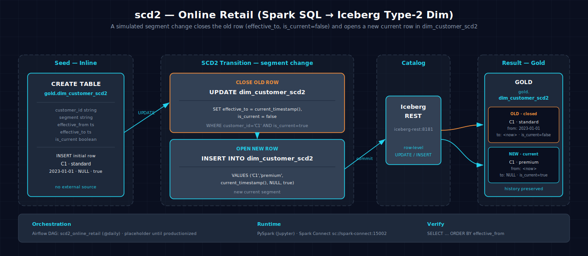

<!-- AUTO-GENERATED — do not edit; run scripts/build_docs.py -->
# scd2-online_retail-spark-iceberg

Implements Slowly Changing Dimension Type 2 (SCD2) to track historical changes on a customer dimension, preserving full history with effective timestamps and current flags.

## 1. Purpose

SCD2 is a cornerstone of dimensional data warehousing, enabling time-travel queries on dimension changes. This scenario demonstrates Iceberg's native row-level UPDATE and INSERT capabilities, making SCD2 practical: efficient history tracking without full table scans or partition rewrites. When a customer's segment changes, the old row is closed (setting `effective_to` and `is_current=false`) and a new row is opened with the updated segment (`effective_from`, `is_current=true`).

## 2. Data Model

### 2.1 Input Source

Source: Online retail dimension data (inline seed in notebooks — no external dataset required).

| Column | Type | Notes |
|---|---|---|
| `CustomerID` | double | Customer identifier |
| `Name` | string | Customer name |
| `Segment` | string | Customer segment |

### 2.2 Output Tables

| Table | Layer | Key Columns |
|---|---|---|
| `lakehouse.gold.dim_customer_scd2` | Gold (dimension) | `CustomerID`, `Name`, `Segment`, `effective_from`, `effective_to`, `is_current` |

## 3. Architecture



Data flows from inline seed data through Spark batch processing with SCD2 logic. The notebook seeds initial customer data, then simulates a segment change by closing the old row and opening a new row with the updated segment and effective timestamps. This demonstrates how Iceberg handles row-level updates efficiently.

## 4. Notebooks

- **Zeppelin (Scala):** `zeppelin/notebook.zpln` — Sections: Overview, Seed Data, Apply SCD2 Logic (close old row, open new row), Query Historical Records, Verify
- **Jupyter (PySpark):** `jupyter/notebook.ipynb` — Same sections; same SCD2 logic using PySpark `when()` and DataFrame updates with `effective_from`/`effective_to`/`is_current` tracking

Both languages implement identical SCD2 logic: seeding, history tracking via effective timestamps and current flags, and verification sections.

## 5. Orchestration

Airflow DAG: `scd2_online_retail` — a scheduled batch DAG.

## 6. Usage

1. Ensure the `gold` Iceberg namespace exists: `scripts/register_iceberg.py`
2. Open either notebook on the Atlas stack, or trigger the Airflow DAG:
      ```bash
   airflow dags trigger scd2_online_retail
      ```
3. Verify:
      ```bash
   spark-sql -e "SELECT * FROM lakehouse.gold.dim_customer_scd2"
      ```

## 7. Dependencies

- **Dataset:** Online retail dimension data (inline seed)
- **Atlas services:** A1-A4 (Spark, Iceberg, S3 catalog, lakehouse catalog)
- **Other:** None
- **Note:** Iceberg row-level UPDATE is an SQL extension; ensure `iceberg.sql.extensions` is enabled in Spark configuration

## 8. Known Issues & Caveats

Notebook execution and Scala/PySpark parity are live-gated on Atlas A1-A4. The `gold` namespace must exist; run `scripts/register_iceberg.py` first. The notebook's seed INSERT is not guarded; re-running the full notebook accumulates seed rows. Drop the target table first for a clean demo. At scale, the inline seed can be replaced by the registered `online_retail` dataset.

## See Also

- [Related: incremental_upsert-online_retail-spark-iceberg](../incremental_upsert-online_retail-spark-iceberg/README.md) — Batch form of the same CDC upsert pattern
- [Related: cdc_streaming-online_retail-spark-iceberg](../cdc_streaming-online_retail-spark-iceberg/README.md) — Streaming CDC version of upserts
- [Datasets](../../README.md#datasets)
- [Lakehouse Architecture](../../README.md#lakehouse-architecture)
