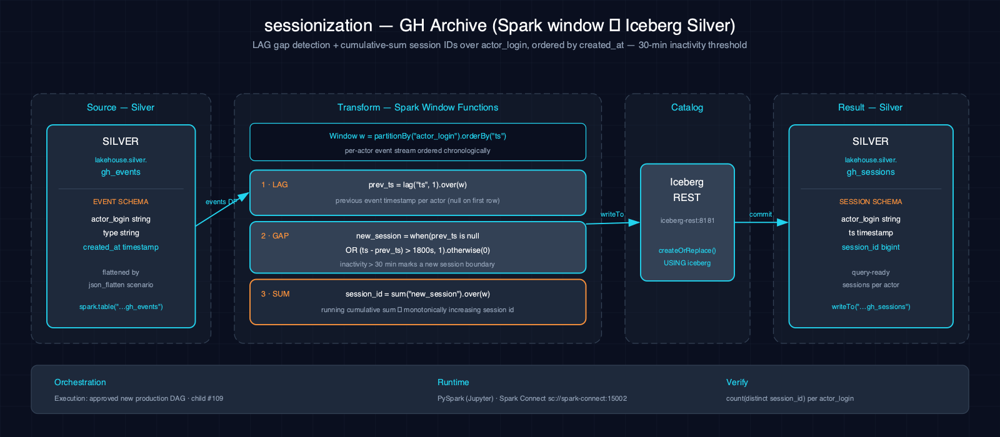

# sessionization-gh_archive-spark-iceberg

Detects user sessions from GitHub Archive events using window functions and gap-based sessionization with a 30-minute inactivity threshold.

## 1. Purpose

Sessionization is a foundational pattern in event-driven analytics, used to understand user behavior patterns, engagement, and activity flows. This scenario showcases advanced window function techniques: partitioning events by `actor_login`, ordering by timestamp, detecting inactivity gaps exceeding 30 minutes using the `LAG` window function, and assigning session IDs via a cumulative sum over gap indicators.

## 2. Data Model

### 2.1 Input Source

Source: compressed GitHub Archive JSON objects from one resolver-verified immutable generation. The notebook sessionizes them directly and writes `lakehouse.silver.gh_sessions`.

| Column | Type | Notes |
|---|---|---|
| `actor_login` | string | Partition key for session detection |
| `created_at` | timestamp | Used for ordering and gap detection |
| `type` | string | Event type |
| `repo_name` | string | Repository name |

### 2.2 Output Tables

| Table | Layer | Key Columns |
|---|---|---|
| `lakehouse.silver.gh_sessions` | Silver | `actor_login`, `session_id`, `created_at`, `type` |

## 3. Architecture



Data flows from the GitHub Events silver table through Spark batch processing. Events are partitioned by `actor_login`, ordered by timestamp, and the `LAG` window function detects gaps > 30 minutes between consecutive events. Sessions are assigned IDs via cumulative sum over gap indicators, and each output row includes the actor login and its session ID.

## 4. Notebooks

- **Zeppelin (Scala):** `zeppelin/notebook.zpln` — Sections: Overview, Read Events, Compute LAG, Detect Gaps (> 30 min), Assign Session IDs, Write to Iceberg, Verify
- **Jupyter (PySpark):** `jupyter/notebook.ipynb` — Same sections; same sessionization logic using `lag()`, `when()`, and `sum().over()` window operations in PySpark

Both languages implement identical sessionization logic with gap detection, session assignment, and verification.

## 5. Orchestration

Classification: **approved new production DAG**. No production DAG exists yet. Child #109 owns this independently tested sessionization stage and enforces a successful matching flatten prerequisite; until it passes live acceptance, run the paired notebooks only.

## 6. Usage

1. Ensure the `silver` Iceberg namespace exists: `scripts/register_iceberg.py`
2. Publish the expected GitHub Archive tier with `make datasets SCALE=<tier>`.
3. Open either notebook on the Atlas stack.
4. Verify:
      ```bash
   spark-sql -e "SELECT actor_login, COUNT(DISTINCT session_id) AS num_sessions FROM lakehouse.silver.gh_sessions GROUP BY actor_login LIMIT 10"
      ```

## 7. Dependencies

- **Dataset:** GitHub Archive events (via `lakehouse.silver.gh_events`)
- **Atlas services:** A1-A4 (Spark, Iceberg, S3 catalog, lakehouse catalog)
- **Other:** None

## 8. Known Issues & Caveats

The 30-minute gap threshold is hardcoded as 1800 seconds and not externally configurable. The `silver` namespace must exist; run `scripts/register_iceberg.py` first. The notebook resolves and verifies GitHub Archive directly, so it does not depend on the JSON-flatten table.

## See Also

- [Related: json_flatten-gh_archive-spark-iceberg](../json_flatten-gh_archive-spark-iceberg/README.md) — Produces a separate flattened-events table from the same source dataset
- [Related: schema_evolution-gh_archive-spark-iceberg](../schema_evolution-gh_archive-spark-iceberg/README.md) — Another GitHub Archive processing scenario
- [Datasets](../../docs/datasets.md)
- [Lakehouse Architecture](../../docs/lakehouse.md)
