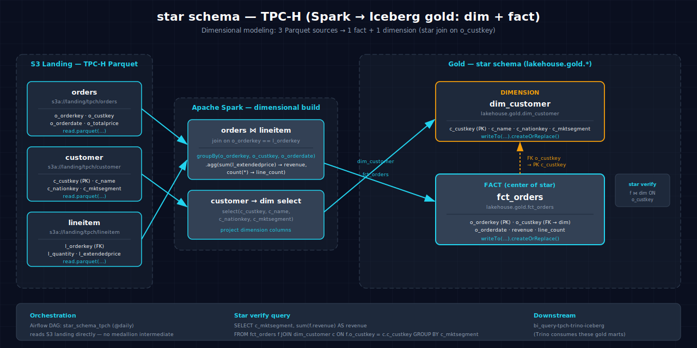

<!-- AUTO-GENERATED — do not edit; run scripts/build_docs.py -->
# star_schema-tpch-spark-iceberg

Builds fact and dimension tables from the TPC-H dataset using star schema dimensional modeling, creating `dim_customer` and `fct_orders` in the gold layer.

## 1. Purpose

Star schema design is the foundation of dimensional data warehousing. This scenario demonstrates how to implement a star schema in Spark over a lakehouse: joining source tables (orders, customer, lineitem) into a structured dimensional model optimized for analytical queries and BI tool consumption. The dimension table (`dim_customer`) and fact table (`fct_orders`) serve as the canonical data model for downstream queries.

## 2. Data Model

### 2.1 Input Source

Source: TPC-H Parquet datasets in S3 (`s3a://landing/tpch/`), downloaded via `make datasets`.

**orders table** (`s3a://landing/tpch/orders`):

| Column | Type | Notes |
|---|---|---|
| `o_orderkey` | long | Order key (FK in fact) |
| `o_custkey` | long | Customer key (FK to dimension) |
| `o_totalprice` | double | Order total |
| `o_orderstatus` | string | Order status |

**customer table** (`s3a://landing/tpch/customer`):

| Column | Type | Notes |
|---|---|---|
| `c_custkey` | long | Customer key (PK) |
| `c_name` | string | Customer name |
| `c_mktsegment` | string | Market segment |

**lineitem table** (`s3a://landing/tpch/lineitem`):

| Column | Type | Notes |
|---|---|---|
| `l_orderkey` | long | Order key (FK) |
| `l_quantity` | double | Line item quantity |
| `l_extendedprice` | double | Line item extended price |

### 2.2 Output Tables

| Table | Layer | Key Columns |
|---|---|---|
| `lakehouse.gold.dim_customer` | Gold (dimension) | `c_custkey` (PK), `c_name`, `c_mktsegment` |
| `lakehouse.gold.fct_orders` | Gold (fact) | `o_orderkey` (PK), `o_custkey` (FK), `o_orderstatus`, `o_totalprice`, `l_quantity`, `l_extendedprice` |

## 3. Architecture



Data flows from three Parquet tables in S3 (`orders`, `customer`, `lineitem`) through Spark batch processing. Orders are joined with lineitems on order key, then joined with customers on customer key. The result produces two gold-layer Iceberg tables: a dimension table (`dim_customer`) and a fact table (`fct_orders`), forming a star schema.

## 4. Notebooks

- **Zeppelin (Scala):** `zeppelin/notebook.zpln` — Sections: Overview, Read Sources (3 Parquet tables), Join Orders+Lineitems, Join + Customer, Create Dimensions, Create Fact Table, Write to Gold, Verify
- **Jupyter (PySpark):** `jupyter/notebook.ipynb` — Same 8 sections; same dimensional modeling logic using PySpark DataFrame joins, dimension construction, fact table aggregation

Both languages implement identical star schema logic: source ingestion, multi-table joins, dimension/fact table creation, and verification of schema and row counts.

## 5. Orchestration

Airflow DAG: `star_schema_tpch` — a scheduled batch DAG.

## 6. Usage

1. Ensure the `gold` Iceberg namespace exists: `scripts/register_iceberg.py`
2. Populate the TPC-H dataset: `make datasets` to download Parquet files to S3
3. Open either notebook on the Atlas stack, or trigger the Airflow DAG:
     ```bash
   airflow dags trigger star_schema_tpch
     ```
4. Verify output:
     ```bash
   spark-sql -e "SELECT COUNT(*) FROM lakehouse.gold.dim_customer"
   spark-sql -e "SELECT COUNT(*) FROM lakehouse.gold.fct_orders"
     ```

## 7. Dependencies

- **Dataset:** TPC-H Parquet (`orders`, `customer`, `lineitem`) from `s3a://landing/tpch/`
- **Atlas services:** A1-A4 (Spark, Iceberg, S3 catalog, lakehouse catalog)
- **Other:** None
- **Note:** Reads directly from S3 landing — no medallion intermediate layers

## 8. Known Issues & Caveats

Notebook execution and Scala/PySpark parity are live-gated on Atlas A1-A4. The `gold` namespace must exist in the Iceberg REST catalog; run `scripts/register_iceberg.py` before executing standalone. `make datasets` is required to populate the TPC-H landing zone before the notebook can read data.

## See Also

- [Downstream: bi_query-tpch-trino-iceberg](../bi_query-tpch-trino-iceberg/README.md) — Queries gold marts via Trino
- [Downstream: join_optimization-tpch-spark-iceberg](../join_optimization-tpch-spark-iceberg/README.md) — Uses gold tables for join optimization demos
- [Datasets](../../README.md#datasets)
- [Lakehouse Architecture](../../README.md#lakehouse-architecture)
