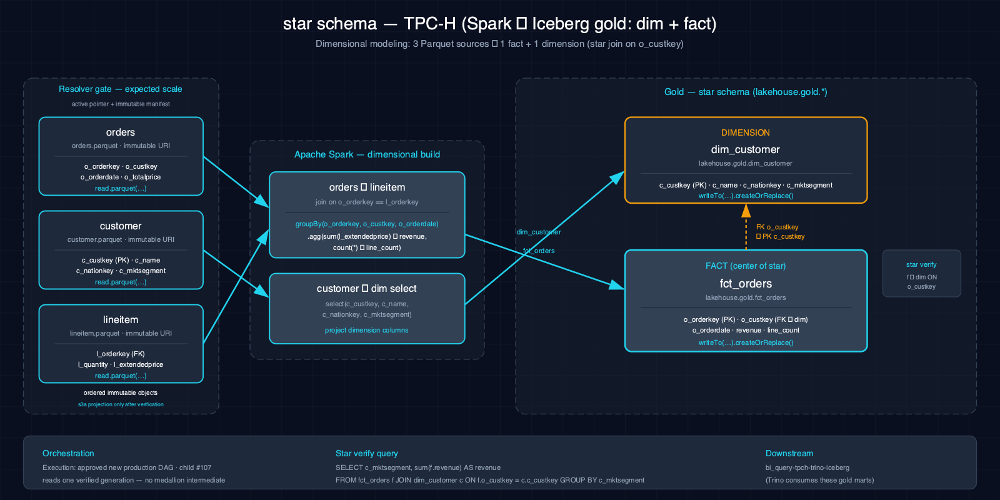

# star_schema-tpch-spark-iceberg

Builds fact and dimension tables from the TPC-H dataset using star schema dimensional modeling, creating `dim_customer` and `fct_orders` in the gold layer.

## 1. Purpose

Star schema design is the foundation of dimensional data warehousing. This scenario demonstrates how to implement a star schema in Spark over a lakehouse: joining source tables (orders, customer, lineitem) into a structured dimensional model optimized for analytical queries and BI tool consumption. The dimension table (`dim_customer`) and fact table (`fct_orders`) serve as the canonical data model for downstream queries.

## 2. Data Model

### 2.1 Input Source

Source: TPC-H Parquet objects from one resolver-verified immutable generation published by `make datasets`.

**orders table** (`orders.parquet` in the resolved generation):

| Column | Type | Notes |
|---|---|---|
| `o_orderkey` | long | Order key (FK in fact) |
| `o_custkey` | long | Customer key (FK to dimension) |
| `o_totalprice` | decimal(15,2) | Order total |
| `o_orderstatus` | string | Order status |

**customer table** (`customer.parquet` in the resolved generation):

| Column | Type | Notes |
|---|---|---|
| `c_custkey` | long | Customer key (PK) |
| `c_name` | string | Customer name |
| `c_mktsegment` | string | Market segment |

**lineitem table** (`lineitem.parquet` in the resolved generation):

| Column | Type | Notes |
|---|---|---|
| `l_orderkey` | long | Order key (FK) |
| `l_quantity` | decimal(15,2) | Line item quantity |
| `l_extendedprice` | decimal(15,2) | Line item extended price |

### 2.2 Output Tables

| Table | Layer | Key Columns |
|---|---|---|
| `lakehouse.gold.dim_customer` | Gold (dimension) | `c_custkey`, `c_name`, `c_nationkey`, `c_mktsegment` |
| `lakehouse.gold.fct_orders` | Gold (fact) | `o_orderkey`, `o_custkey`, `o_orderdate`, `revenue`, `line_count` |

## 3. Architecture



Airflow resolves one complete immutable eight-object TPC-H publication. The Spark application validates customer, orders, and lineitem keys, projects the customer dimension, aggregates line revenue per order, and atomically replaces each gold table with matching source-generation properties.

## 4. Notebooks

- **Zeppelin (Scala):** `zeppelin/notebook.zpln` — Sections: Overview, Read Sources (3 Parquet tables), Join Orders+Lineitems, Join + Customer, Create Dimensions, Create Fact Table, Write to Gold, Verify
- **Jupyter (PySpark):** `jupyter/notebook.ipynb` — Same 8 sections; same dimensional modeling logic using PySpark DataFrame joins, dimension construction, fact table aggregation

Both languages implement identical star schema logic: source ingestion, multi-table joins, dimension/fact table creation, and verification of schema and row counts.

> **Production trust boundary:** The notebooks are not a production write path. They directly
> replace the same two tables without the application's complete-publication, key, serialization,
> or provenance checks and can invalidate downstream #83. Use the `tpch_star_schema` DAG/application
> for production writes; use notebooks only in an isolated educational environment whose outputs may
> be overwritten by a subsequent production run.

## 5. Orchestration

Classification: **existing production DAG**. `spark-apps/tpch-star-schema/dag.py` runs `tpch_star_schema` daily through the Atlas REST-confirming Spark submission contract. Manual runs accept an explicit `dataset_scale`; `max_active_runs=1` serializes the non-atomic two-table replacement. The notebooks remain the educational parity surface; downstream Trino child #83 must compare both tables' exact five Iceberg provenance properties before querying them.

## 6. Usage

1. Ensure the `gold` Iceberg namespace exists: `scripts/register_iceberg.py`
2. Populate the TPC-H dataset: `make datasets` to download Parquet files to S3
3. Publish `s3a://jars/tpch-star-schema/0.1.0/app.jar` through Jenkins.
4. Trigger `tpch_star_schema` with `{"dataset_scale":"tiny"}`. Open either notebook only for isolated education, never as an equivalent production write.
5. Verify output:
     ```bash
   spark-sql -e "SELECT COUNT(*) FROM lakehouse.gold.dim_customer"
   spark-sql -e "SELECT COUNT(*) FROM lakehouse.gold.fct_orders"
     ```

## 7. Dependencies

- **Dataset:** resolver-verified immutable TPC-H Parquet (`orders.parquet`, `customer.parquet`, `lineitem.parquet`)
- **Atlas services:** A1-A4 (Spark, Iceberg, S3 catalog, lakehouse catalog)
- **Other:** None
- **Note:** Reads the resolver-returned immutable S3 objects directly — no medallion intermediate layers

## 8. Known Issues & Caveats

Notebook execution and Scala/PySpark parity are live-gated on Atlas A1-A4. The `gold` namespace must exist in the Iceberg REST catalog; run `scripts/register_iceberg.py` before executing standalone. `make datasets` is required to populate the TPC-H landing zone before the notebook can read data.

## See Also

- [Downstream: bi_query-tpch-trino-iceberg](../bi_query-tpch-trino-iceberg/README.md) — Queries gold marts via Trino
- [Downstream: join_optimization-tpch-spark-iceberg](../join_optimization-tpch-spark-iceberg/README.md) — Uses gold tables for join optimization demos
- [Datasets](../../docs/datasets.md)
- [Lakehouse Architecture](../../docs/lakehouse.md)
