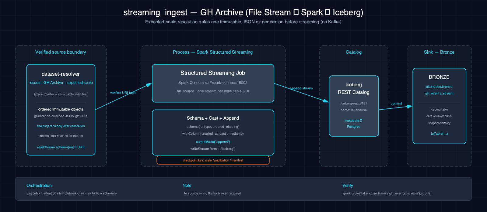

# streaming_ingest-gh_archive-spark-iceberg

Demonstrate Iceberg ingestion via Structured Streaming with a file source: read JSON files incrementally from S3 landing, parse with schema, cast the timestamp column, and write to Iceberg with checkpoints for exactly-once semantics. No Kafka or external messaging queue required.

## 1. Purpose

This scenario demonstrates Structured Streaming to Iceberg using a simple file source (not Kafka), which enables exactly-once ingestion semantics and checkpointing for fault tolerance. It is useful when the data source is a directory of files rather than a message queue, and it does not require Atlas A9 (Redpanda).

## 2. Data Model

### 2.1 Input Source

Source: compressed GitHub Archive JSON objects from one resolver-verified immutable generation published by `make datasets`.

| Column | Type | Notes |
|---|---|---|
| `id` | string | Event ID |
| `type` | string | Event type (e.g., PushEvent, CreateEvent) |
| `created_at` | timestamp | Event creation time (casted from string) |
| Other nested fields | varied | Extracted via dot notation (`actor.login` → `actor_login`, `repo.name` → `repo_name`) |

Checkpoint: `s3a://checkpoints/gh_events_file/<scale>/<publication-id>/<manifest-sha256>`

### Checkpoint policy (#85)

Checkpoint ID `streaming-gh-archive-file-v1` is owned by **Streaming Data Engineering Education** and classified as **generation reproducibility** state. Its concrete leaf binds the exact resolver generation by scale, publication ID, and manifest SHA-256. While active or uncertain it is retained; a completed or stopped leaf waits 14 days. Recovery must re-resolve that exact resolver generation and reset `lakehouse.bronze.gh_events_stream` before replay. Manual exact-leaf retention is available through issue #86's reviewed plan/prepare/apply protocol. Automated and scheduled deletion remain disabled pending stronger MinIO cross-process CAS and conditional delete proof.

### 2.2 Output Tables

| Table | Layer | Key Columns |
|---|---|---|
| `lakehouse.bronze.gh_events_stream` | Bronze | `id`, `type`, `created_at`, `actor_login`, `repo_name` |

## 3. Architecture



Data flows from the resolver-ordered immutable object URIs through Spark Structured Streaming with one file stream per URI, unioned within the run. The stream defines a schema, casts `created_at` to timestamp, and writes to Iceberg with a checkpoint path scoped by scale, publication, and manifest identity.

## 4. Notebooks

- **Zeppelin (Scala):** `zeppelin/notebook.zpln` — Sections: Overview, Setup, Read (file source), Transform (schema + cast), Write (Iceberg), Verify
- **Jupyter (PySpark):** `jupyter/notebook.ipynb` — Sections: Overview, Setup, Read (file source), Transform (schema + cast), Write (Iceberg), Verify

Both notebooks implement identical streaming ingest logic with file source, schema definition, field extraction, and sink write.

## 5. Orchestration

Classification: **intentionally notebook-only**. No Airflow DAG or schedule exists. This finite resolver-locked file set demonstrates checkpointed file discovery but waits as a stream, so an operator bounds either paired notebook run explicitly.

## 6. Usage

1. Ensure the `bronze` Iceberg namespace exists: `scripts/register_iceberg.py`
2. Populate the landing zone: `make datasets`
3. Open either notebook on the Atlas stack.
4. Verify output:
    ```bash
    spark-sql -e "SELECT COUNT(*) FROM lakehouse.bronze.gh_events_stream"
    ```

## 7. Dependencies

- **Dataset:** GitHub Archive compressed JSON (via `make datasets`)
- **Atlas services:** A1-A4 (Spark, Iceberg, S3 catalog, lakehouse catalog)
- **Other:** None; uses file source, does not require Atlas A9 (Redpanda)

Requires `lakehouse.bronze` namespace to exist before running.

## 8. Known Issues & Caveats

Notebook execution and Scala/PySpark parity are live-gated on Atlas A1-A4. This scenario uses a file source, not Kafka, so it does not require Atlas A9. Run `scripts/register_iceberg.py` and `make datasets` before executing standalone.

## See Also

- [Downstream: json_flatten-gh_archive-spark-iceberg](../json_flatten-gh_archive-spark-iceberg/README.md) — Also consumes GitHub Archive data
- [Downstream: sessionization-gh_archive-spark-iceberg](../sessionization-gh_archive-spark-iceberg/README.md) — Consumes stream events
- [Datasets](../../docs/datasets.md)
- [Lakehouse Architecture](../../docs/lakehouse.md)
