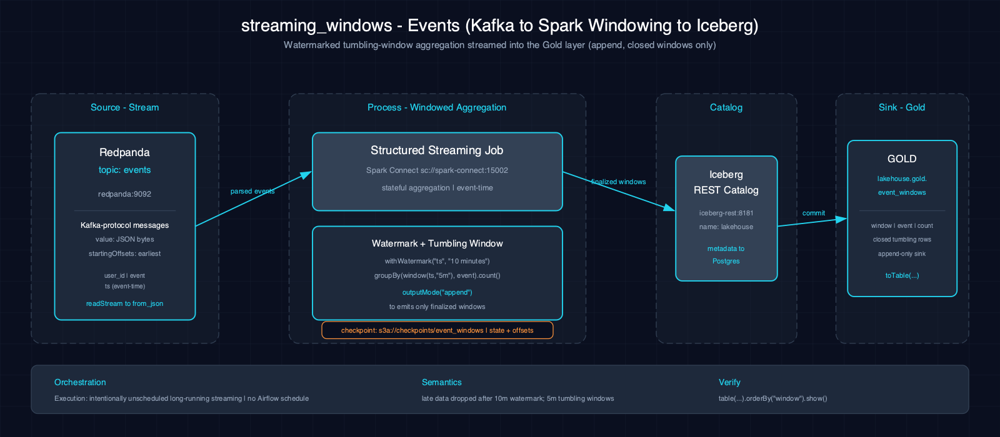

# streaming_windows-events-spark-iceberg

Windowed aggregation with watermark on the Redpanda `events` Kafka topic, writing closed window counts to `lakehouse.gold.event_windows` (Iceberg).

## 1. Purpose

This scenario demonstrates windowed aggregation with watermark on a Kafka stream — the aggregated streaming counterpart to the `streaming_ingest-events` scenario. It teaches how to define watermarks to handle late data and emit only closed windows to Iceberg in append mode, a critical pattern for real-time analytics.

## 2. Data Model

### 2.1 Input Source

Source: `redpanda:9092` → `events` Kafka topic (same data source as `streaming_ingest-events`; produced by `producer.py`).

| Column | Type | Notes |
|---|---|---|
| `user_id` | string | User identifier |
| `event` | string | Event type |
| `ts` | timestamp | Event timestamp |

Checkpoint: `s3a://checkpoints/event_windows`

### Checkpoint policy (#85)

Checkpoint ID `streaming-event-windows-v1` is owned by **Streaming Data Engineering** and classified as a **durable stream**. While active or uncertain it is never age-deleted. Eligibility requires reviewed retirement, a stopped or retired terminal lease, approved recovery, and a 30-day quarantine. Starting from a fresh checkpoint can duplicate append output. Manual exact-leaf retention is available through issue #86's reviewed plan/prepare/apply protocol. Automated and scheduled deletion remain disabled pending stronger MinIO cross-process CAS and conditional delete proof.

### 2.2 Output Tables

| Table | Layer | Key Columns |
|---|---|---|
| `lakehouse.gold.event_windows` | Gold | `event`, `window_start`, `window_end`, `count` |

## 3. Architecture



Data flows from the Redpanda `events` topic through Spark Structured Streaming with `withWatermark` and `groupBy` over tumbling windows (5-minute windows, 10-minute watermark). Aggregation: counts events per event type per window. Results are written to Iceberg in append mode — only closed windows emit.

## 4. Notebooks

- **Zeppelin (Scala):** `zeppelin/notebook.zpln` — Sections: Overview, Setup, Read (`readStream` + schema + `from_json`), Transform (`withWatermark` + `groupBy` window + `count`), Write (`writeStream` Iceberg append), Verify; 6 sections
- **Jupyter (PySpark):** `jupyter/notebook.ipynb` — Same 6 sections, same windowed streaming logic

Both languages implement identical windowed streaming logic with watermark definition, tumbling window aggregation, and verification.

## 5. Orchestration

Classification: **intentionally unscheduled long-running streaming**. No Airflow DAG or batch schedule exists. An operator starts, monitors watermark progress, and stops the continuous notebook query and owns its `event_windows` checkpoint.

## 6. Usage

1. Start Atlas with Redpanda: `make up`
2. Produce events: `python scenarios/streaming_ingest-events-spark-iceberg/producer.py [count]`
3. Open either notebook on the Atlas stack and run all sections
4. Closed windows appear in `lakehouse.gold.event_windows`
5. Verify:
    ```bash
    spark-sql -e "SELECT * FROM lakehouse.gold.event_windows LIMIT 10"
    ```

## 7. Dependencies

- **Dataset:** Synthetic events from `streaming_ingest-events-spark-iceberg/producer.py`
- **Atlas services:** A1-A4 (Spark, Iceberg, S3 catalog, lakehouse catalog), A9 (Redpanda)
- **Other:** None

## 8. Known Issues & Caveats

Atlas seeds only the `atlas_stream_events` demo topic; this scenario's topic (`events`) is auto-created on first produce. Notebook execution and Scala/PySpark parity are live-gated on Atlas A9 (Redpanda). Produce events first via `streaming_ingest-events-spark-iceberg/producer.py`. Checkpoints at `s3a://checkpoints/event_windows`. Append mode emits only closed windows (after watermark passes); call `query.awaitTermination()` to block in both Scala and PySpark notebooks.

## See Also

- [Upstream: streaming_ingest-events-spark-iceberg](../streaming_ingest-events-spark-iceberg/README.md) — Produces the events topic this scenario consumes
- [Related: cdc_streaming-online_retail-spark-iceberg](../cdc_streaming-online_retail-spark-iceberg/README.md) — Another CDC/streaming scenario
- [Datasets](../../docs/datasets.md)
- [Lakehouse Architecture](../../docs/lakehouse.md)
