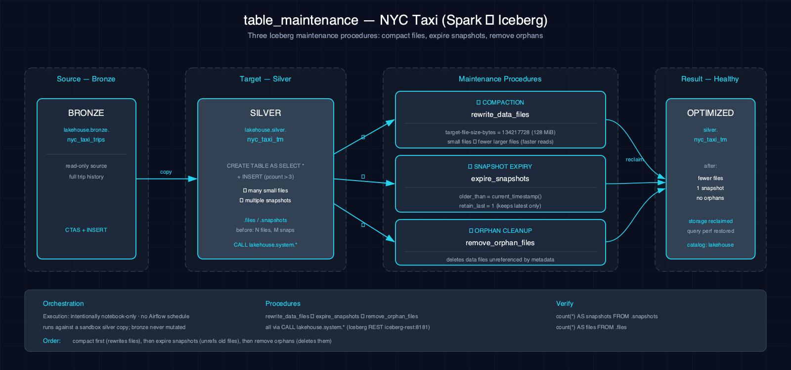

# table_maintenance-nyc_taxi-spark-iceberg

Demonstrates Iceberg file compaction, snapshot expiry, and orphan-file removal on a scenario-owned NYC taxi table.

## 1. Purpose

The paired notebooks copy Bronze NYC taxi rows into an isolated table, add another snapshot, compact data files with `rewrite_data_files`, expire older snapshots with `retain_last => 1`, and call `remove_orphan_files`. These are destructive operator demonstrations, not a production retention policy.

## 2. Data Model

### 2.1 Input Source

Source: `lakehouse.bronze.nyc_taxi_trips` (populated by `batch_ingest-nyc_taxi-spark-iceberg`).

| Column | Type | Notes |
|---|---|---|
| `VendorID` | double | Vendor identifier |
| `tpep_pickup_datetime` | timestamp | Pickup timestamp |
| `tpep_dropoff_datetime` | timestamp | Dropoff timestamp |
| `passenger_count` | double | Number of passengers (canonicalized in Bronze) |
| `trip_distance` | double | Trip distance in miles |
| `fare_amount` | double | Fare amount |
| `total_amount` | double | Total amount |
| `PULocationID` | int | Pickup location ID |
| `DOLocationID` | int | Dropoff location ID |

### 2.2 Output Tables

| Table | Layer | Key Columns |
|---|---|---|
| `lakehouse.silver.nyc_taxi_tm` | Silver | Scenario-owned compaction and cleanup target |

## 3. Architecture



NYC taxi trip data is copied from Bronze into `nyc_taxi_tm`. The notebooks append a filtered copy, inspect file metadata, compact files, expire snapshots while retaining one, remove orphan files, and inspect the resulting snapshot and file counts.

## 4. Notebooks

- **Zeppelin (Scala):** `zeppelin/notebook.zpln` — creates and appends to `nyc_taxi_tm`, then calls `rewrite_data_files`, `expire_snapshots`, and `remove_orphan_files`
- **Jupyter (PySpark):** `jupyter/notebook.ipynb` — executes the same SQL procedures and verification queries

Both languages implement the same compaction, snapshot-expiry, orphan-removal, and metadata-verification sequence.

## 5. Orchestration

Classification: **intentionally notebook-only**. No Airflow DAG or schedule exists. Compaction, snapshot expiry, and orphan removal remain operator-run demonstrations restricted to the isolated `nyc_taxi_tm` table.

## 6. Usage

1. Ensure the `silver` and `gold` Iceberg namespaces exist: `scripts/register_iceberg.py`
2. Open either notebook on the Atlas stack.
3. Verify:
     ```bash
     spark-sql -e "SELECT COUNT(*) FROM lakehouse.silver.nyc_taxi_tm"
     ```

## 7. Dependencies

- **Dataset:** NYC taxi trip data (via `lakehouse.bronze.nyc_taxi_trips` populated by batch_ingest)
- **Atlas services:** A1-A4 (Spark, Iceberg, S3 catalog, lakehouse catalog)
- **Other:** Iceberg table maintenance must be enabled in configuration

## 8. Known Issues & Caveats

Notebook execution and Scala/PySpark parity are live-gated on Atlas A1-A4. The `silver` namespace must exist; run `scripts/register_iceberg.py` first. The notebooks deliberately pass `older_than => current_timestamp()` and retain only one snapshot, so run them only against the isolated scenario table.

## See Also

- [Related: batch_ingest-nyc_taxi-spark-iceberg](../batch_ingest-nyc_taxi-spark-iceberg/README.md) — Produces the bronze source data
- [Related: medallion-nyc_taxi-spark-iceberg](../medallion-nyc_taxi-spark-iceberg/README.md) — Full medallion pipeline
- [Production Spark app: nyc-taxi-medallion](../../spark-apps/nyc-taxi-medallion/README.md) — Phase-3a JAR productionizes this scenario for Airflow
- [Datasets](../../docs/datasets.md)
- [Lakehouse Architecture](../../docs/lakehouse.md)
