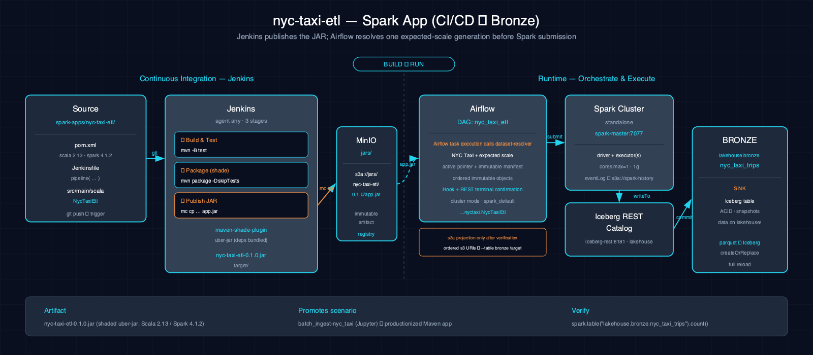

# NYC Taxi ETL — Raw to Bronze

This Spark application reads the configured NYC Taxi Parquet landing set, normalizes the monthly schemas, filters invalid trips, and replaces the Bronze Iceberg table. Jenkins builds and publishes the application artifact; Airflow submits it to the Atlas Spark standalone cluster and confirms the terminal driver status.

## 1. Architecture



Jenkins publishes the Maven output as `s3a://jars/nyc-taxi-etl/0.1.0/app.jar`. The published object name is deliberately stable even though the local Maven artifact is `target/nyc-taxi-etl-0.1.0.jar`.

## 2. Project Structure

- **Language:** Scala (2.13.14)
- **Runtime target:** Spark 4.1.2 on Java 17
- **Build and tests:** Maven with ScalaTest 3.2.19 and the Maven Shade plugin
- **Landing reader:** `src/main/scala/com/thekaveh/dataeng/nyctaxi/TaxiLanding.scala`
- **Transform source:** `src/main/scala/com/thekaveh/dataeng/nyctaxi/transforms/TaxiTransforms.scala`
- **Entrypoint source:** `src/main/scala/com/thekaveh/dataeng/nyctaxi/NycTaxiEtl.scala`
- **Entrypoint class:** `com.thekaveh.dataeng.nyctaxi.NycTaxiEtl`
- **Automation:** `Jenkinsfile` and `dag.py` at the application root

The entrypoint accepts two positional arguments: the landing prefix followed by the target table. Their defaults are `s3a://landing/nyc_taxi/` and `lakehouse.bronze.nyc_taxi_trips`.

## 3. Transform Logic

`TaxiLanding.read` selects the configured monthly objects, reads each Parquet file separately, casts `passenger_count` to `double`, and then unions the normalized DataFrames. Its default `small` scale selects the January through March 2023 files.

`TaxiTransforms.clean` then:

1. keeps rows whose `tpep_pickup_datetime` is not null;
2. keeps rows whose `passenger_count` is greater than zero; and
3. derives `trip_date` from `tpep_pickup_datetime`.

The entrypoint creates the target namespace if necessary and writes the cleaned DataFrame with `createOrReplace()`. It does not declare an Iceberg partition specification.

## 4. Build and Test

```bash
mvn -q -B -f spark-apps/nyc-taxi-etl/pom.xml test
mvn -q -B -f spark-apps/nyc-taxi-etl/pom.xml package
```

The package step produces `spark-apps/nyc-taxi-etl/target/nyc-taxi-etl-0.1.0.jar`. The Jenkins publish stage creates an `atlas` MinIO alias from its injected endpoint and credentials, then copies that file to `s3a://jars/nyc-taxi-etl/0.1.0/app.jar`.

## 5. Run with Airflow

The `nyc_taxi_etl` DAG contains one `AtlasSparkSubmitOperator` task. This
`SparkSubmitOperator` subclass preserves the provider's normal execution and
OpenLineage injection, while `_get_hook()` wraps the provider hook with Atlas's
`RestConfirmingSparkHook`. The task uses these source-backed settings:

- **application:** `s3a://jars/nyc-taxi-etl/0.1.0/app.jar`
- **class:** `com.thekaveh.dataeng.nyctaxi.NycTaxiEtl`
- **arguments:** `s3a://landing/nyc_taxi/`, then `lakehouse.bronze.nyc_taxi_trips`
- **submission:** Spark standalone cluster mode through `spark://spark-master:7077`
- **Iceberg extension:** `org.apache.iceberg.spark.extensions.IcebergSparkSessionExtensions`
- **completion:** the wrapped hook captures the standalone driver ID from the submission log and requires `driverState=FINISHED` plus `success=true` from `spark-master:6066`

Spark is a `provided` Maven dependency. The Atlas Spark image supplies the Spark, S3A, and Iceberg runtime; the application does not download runtime packages during submission.

## 6. Prerequisites

- The Atlas Spark, Airflow, MinIO, and Iceberg REST services are running.
- Jenkins has the MinIO endpoint and Iceberg access credentials used by the publish stage.
- `s3a://landing/nyc_taxi/` contains the monthly Parquet files for the selected scale.
- `s3a://jars/nyc-taxi-etl/0.1.0/app.jar` has been published.
- The consumer overlay mounts `spark-apps/` below `/opt/airflow/dags`, where the DAG can import Atlas's shared `RestConfirmingSparkHook` adapter from the DAG root.

## 7. Data Flow

```text
selected landing Parquet files
  -> per-file passenger_count normalization
  -> TaxiTransforms.clean
  -> lakehouse.bronze.nyc_taxi_trips (create or replace)
```

## 8. See Also

- [Spark apps overview](../../docs/spark-apps/index.md)
- [Batch-ingest scenario](../../scenarios/batch_ingest-nyc_taxi-spark-iceberg/README.md)
- [Medallion scenario](../../scenarios/medallion-nyc_taxi-spark-iceberg/README.md)
- [Lakehouse architecture](../../docs/lakehouse.md)
- [Datasets](../../docs/datasets.md)
