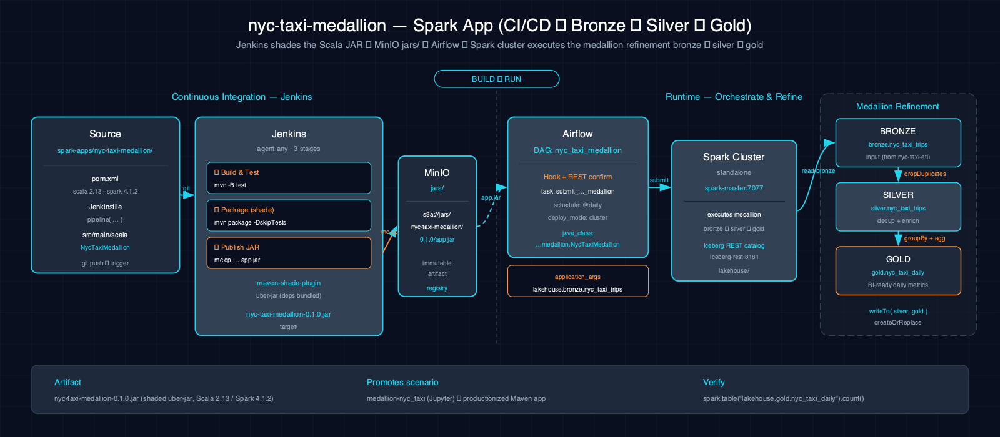

# NYC Taxi Medallion Pipeline

This Spark application replaces the Silver and Gold NYC Taxi Iceberg tables from an existing Bronze table. Jenkins builds and publishes the application artifact; Airflow first resolves one verified immutable NYC Taxi generation for the requested scale, passes that provenance gate with the Bronze-table argument, submits to the Atlas Spark standalone cluster, and confirms the terminal driver status.

## 1. Architecture



Jenkins publishes the Maven output as `s3a://jars/nyc-taxi-medallion/0.1.0/app.jar`. The published object name is deliberately stable even though the local Maven artifact is `target/nyc-taxi-medallion-0.1.0.jar`.

## 2. Project Structure

- **Language:** Scala (2.13.14)
- **Runtime target:** Spark 4.1.2 on Java 17
- **Build and tests:** Maven with ScalaTest 3.2.19 and the Maven Shade plugin
- **Transform source:** `src/main/scala/com/thekaveh/dataeng/medallion/transforms/MedallionTransforms.scala`
- **Entrypoint source:** `src/main/scala/com/thekaveh/dataeng/medallion/NycTaxiMedallion.scala`
- **Entrypoint class:** `com.thekaveh.dataeng.medallion.NycTaxiMedallion`
- **Automation:** `Jenkinsfile` and `dag.py` at the application root

The entrypoint requires one or more ordered `s3://landing/nyc_taxi/_generations/<plan-id>/<publication-id>/<object>.parquet` arguments followed by `--bronze-table <table>`. It validates that the URI set is unique and belongs to one immutable generation, then reads the named Bronze Iceberg table. The Silver and Gold destinations are fixed in the application; there is no flat-path or Bronze-table default.

## 3. Transform Logic

`MedallionTransforms.silver` removes duplicates on the natural trip-key pair `tpep_pickup_datetime` and `tpep_dropoff_datetime`.

`MedallionTransforms.gold` groups the Silver DataFrame by its existing `trip_date` column and emits:

- `trips` from `count(*)`; and
- `avg_fare` from the average of `fare_amount`.

The entrypoint creates `lakehouse.silver` and `lakehouse.gold` when necessary. It writes `lakehouse.silver.nyc_taxi_trips` and `lakehouse.gold.nyc_taxi_daily` with `createOrReplace()`.

## 4. Build and Test

```bash
mvn -q -B -f spark-apps/nyc-taxi-medallion/pom.xml test
mvn -q -B -f spark-apps/nyc-taxi-medallion/pom.xml package
```

The package step produces `spark-apps/nyc-taxi-medallion/target/nyc-taxi-medallion-0.1.0.jar`. The Jenkins publish stage creates an `atlas` MinIO alias from its injected endpoint and credentials, then copies that file to `s3a://jars/nyc-taxi-medallion/0.1.0/app.jar`.

## 5. Run with Airflow

The `nyc_taxi_medallion` DAG contains one `AtlasSparkSubmitOperator` task. This
`SparkSubmitOperator` subclass preserves the provider's normal execution and
OpenLineage injection, while `_get_hook()` wraps the provider hook with Atlas's
`RestConfirmingSparkHook`. The task uses these source-backed settings:

- **application:** `s3a://jars/nyc-taxi-medallion/0.1.0/app.jar`
- **class:** `com.thekaveh.dataeng.medallion.NycTaxiMedallion`
- **arguments:** the resolver-ordered immutable NYC Taxi URI set, then `--bronze-table`, then `lakehouse.bronze.nyc_taxi_trips`
- **submission:** Spark standalone cluster mode through `spark://spark-master:7077`
- **Iceberg extension:** `org.apache.iceberg.spark.extensions.IcebergSparkSessionExtensions`
- **completion:** the wrapped hook captures the standalone driver ID from the submission log and requires `driverState=FINISHED` plus `success=true` from `spark-master:6066`

The DAG does not declare cross-DAG orchestration; the Bronze table must exist before it runs. Spark is a `provided` Maven dependency. The Atlas Spark image supplies the Spark, S3A, and Iceberg runtime; the application does not download runtime packages during submission.

## 6. Prerequisites

- The Atlas Spark, Airflow, MinIO, and Iceberg REST services are running.
- Jenkins has the MinIO endpoint and Iceberg access credentials used by the publish stage.
- `make datasets SCALE=<tier>` has published and verified the expected NYC Taxi generation, and Airflow can reach the internal `dataset-resolver`.
- `lakehouse.bronze.nyc_taxi_trips` exists and includes `trip_date`.
- `s3a://jars/nyc-taxi-medallion/0.1.0/app.jar` has been published.
- The consumer overlay mounts `spark-apps/` below `/opt/airflow/dags`, where the DAG can import Atlas's shared `RestConfirmingSparkHook` adapter from the DAG root.

## 7. Data Flow

```text
verified immutable NYC Taxi generation provenance gate
  -> lakehouse.bronze.nyc_taxi_trips
  -> deduplicate pickup/dropoff pairs
  -> lakehouse.silver.nyc_taxi_trips (create or replace)
  -> group by trip_date
  -> lakehouse.gold.nyc_taxi_daily [trip_date, trips, avg_fare] (create or replace)
```

## 8. See Also

- [Spark apps overview](../../docs/spark-apps/index.md)
- [nyc-taxi-etl](../nyc-taxi-etl/README.md)
- [Medallion scenario](../../scenarios/medallion-nyc_taxi-spark-iceberg/README.md)
- [Batch-ingest scenario](../../scenarios/batch_ingest-nyc_taxi-spark-iceberg/README.md)
- [Lakehouse architecture](../../docs/lakehouse.md)
- [Datasets](../../docs/datasets.md)
